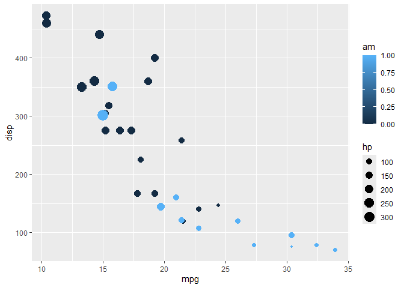
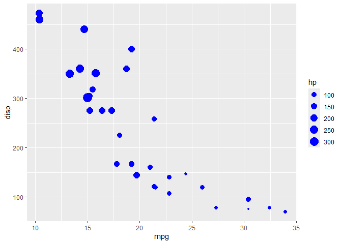
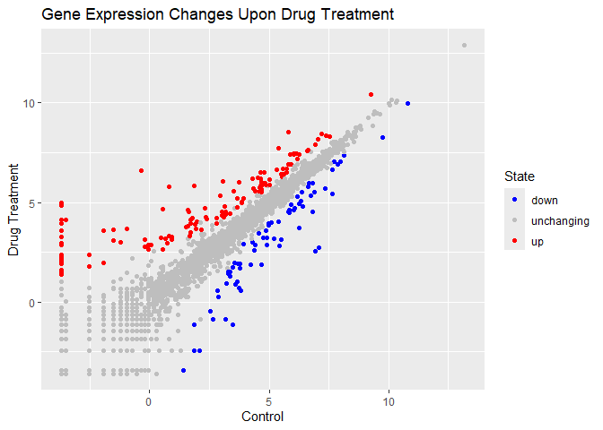
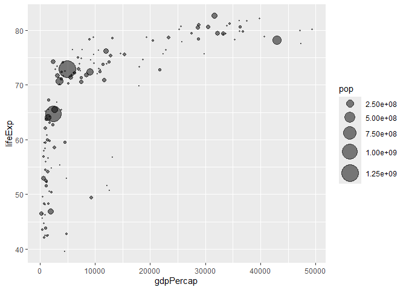

# Class 5: Data Visual with ggplot
Olivia Baldwin

Ways to make figures in R: One of them that **comes with R** is the
`plot()` function.

``` r
plot(cars)
```


A popular package for plots and figures is called **ggplot2**.

Before I can use an add on package, I must install with the
`install.packages()` function. The package name should be in quotes in
this command.

To use the package I need to load it with the `library()` function.

``` r
#install.packages("ggplot2")

library("ggplot2")
```

``` r
ggplot(cars) +
  aes(x=speed, y=dist) +
  geom_point() 
```


For “simple” graphs like this one, base R code is shorter than ggplot
code.

Let’s fit a model and show it on the plot.

``` r
ggplot(cars) +
  aes(x=speed, y=dist) +
  geom_point() +
  geom_smooth() 
```

    `geom_smooth()` using method = 'loess' and formula = 'y ~ x'


Every ggplot has at least 3 layers.

- **data**: data.frame with the numbers you want to plot
- **aesthetics**: mapping of the columns in your data frame to your plot
  - e.g. size of points, position, line type, line width, color, shape
    of points -**geoms**: there are many of these, but the basics are
    `geom_point()`, `geom_line()` and `geom_col()`

``` r
head(mtcars) 
```

                       mpg cyl disp  hp drat    wt  qsec vs am gear carb
    Mazda RX4         21.0   6  160 110 3.90 2.620 16.46  0  1    4    4
    Mazda RX4 Wag     21.0   6  160 110 3.90 2.875 17.02  0  1    4    4
    Datsun 710        22.8   4  108  93 3.85 2.320 18.61  1  1    4    1
    Hornet 4 Drive    21.4   6  258 110 3.08 3.215 19.44  1  0    3    1
    Hornet Sportabout 18.7   8  360 175 3.15 3.440 17.02  0  0    3    2
    Valiant           18.1   6  225 105 2.76 3.460 20.22  1  0    3    1

Make a ggplot of the `mtcars` data using `mgp` vs `disp` and set the
size of the points to the `hp` and set the color to `am`.

``` r
ggplot(mtcars) +
  aes(x=mpg, y=disp, size=hp, col= am) +
  geom_point() 
```



Now, color all the points blue.

``` r
ggplot(mtcars) +
  aes(x=mpg, y=disp, size=hp) +
  geom_point(colour="blue")
```



Make a gene expression plot that colors gene expression changes.

``` r
url <- "https://bioboot.github.io/bimm143_S20/class-material/up_down_expression.txt"
genes <- read.delim(url)
head(genes)
```

            Gene Condition1 Condition2      State
    1      A4GNT -3.6808610 -3.4401355 unchanging
    2       AAAS  4.5479580  4.3864126 unchanging
    3      AASDH  3.7190695  3.4787276 unchanging
    4       AATF  5.0784720  5.0151916 unchanging
    5       AATK  0.4711421  0.5598642 unchanging
    6 AB015752.4 -3.6808610 -3.5921390 unchanging

``` r
nrow(genes)
```

    [1] 5196

``` r
colnames(genes)
```

    [1] "Gene"       "Condition1" "Condition2" "State"     

``` r
ncol(genes)
```

    [1] 4

``` r
table(genes$State)
```


          down unchanging         up 
            72       4997        127 

``` r
table(genes$State)/nrow(genes) *100
```


          down unchanging         up 
      1.385681  96.170131   2.444188 

The functions `nrow()`, `ncol()`, and `table()` are helpful for
summarizing large data frames.

``` r
ggplot(genes) +
  aes(x=Condition1, y=Condition2, col=State) + 
  geom_point() +
  scale_color_manual(values=c("blue", "grey", "red")) +
  labs(title="Gene Expression Changes Upon Drug Treatment", x="Control", y="Drug Treatment") 
```



``` r
url <- "https://raw.githubusercontent.com/jennybc/gapminder/master/inst/extdata/gapminder.tsv"
gapminder <- read.delim(url)
head(gapminder)
```

          country continent year lifeExp      pop gdpPercap
    1 Afghanistan      Asia 1952  28.801  8425333  779.4453
    2 Afghanistan      Asia 1957  30.332  9240934  820.8530
    3 Afghanistan      Asia 1962  31.997 10267083  853.1007
    4 Afghanistan      Asia 1967  34.020 11537966  836.1971
    5 Afghanistan      Asia 1972  36.088 13079460  739.9811
    6 Afghanistan      Asia 1977  38.438 14880372  786.1134

``` r
library(dplyr)
```


    Attaching package: 'dplyr'

    The following objects are masked from 'package:stats':

        filter, lag

    The following objects are masked from 'package:base':

        intersect, setdiff, setequal, union

``` r
gapminder_2007 <- gapminder %>% filter(year==2007)
gapminder_1957 <- gapminder %>% filter(year==1957)
```

Make a plot of the 2007 data.

``` r
ggplot(gapminder_2007) + 
  aes(x=gdpPercap, y=lifeExp, size= pop) +
  geom_point(alpha=0.5) +
  scale_size_area(max_size=10)
```



Make a plot of the 1957 data.

``` r
ggplot(gapminder_1957) +
  aes(x=gdpPercap, y=lifeExp, size= pop, col= continent) +
  geom_point(alpha=0.7) +
  scale_size_area(max_size=15)
```


Make a plot of both 2007 and 1957 data.

``` r
gapminder_1957_2007 <- gapminder %>% filter(year==1957 | year==2007)
ggplot(gapminder_1957_2007) + 
  geom_point(aes(x = gdpPercap, y = lifeExp, color=continent,
                 size = pop), alpha=0.7) + 
  scale_size_area(max_size = 10) +
  facet_wrap(~year)
```


You can use `geom_col()` to create bar charts.

``` r
gapminder_top5 <- gapminder %>% 
  filter(year==2007) %>% 
  arrange(desc(pop)) %>% 
  top_n(5, pop)

gapminder_top5
```

            country continent year lifeExp        pop gdpPercap
    1         China      Asia 2007  72.961 1318683096  4959.115
    2         India      Asia 2007  64.698 1110396331  2452.210
    3 United States  Americas 2007  78.242  301139947 42951.653
    4     Indonesia      Asia 2007  70.650  223547000  3540.652
    5        Brazil  Americas 2007  72.390  190010647  9065.801

You can color by numeric values and get a gradient or categorical and
get different colors for each category.

``` r
ggplot(gapminder_top5) + 
  aes(x = country, y = pop, fill=gdpPercap) +
  geom_col()
```


``` r
ggplot(gapminder_top5) + 
  aes(x=reorder(country, -pop), y = pop, fill=country) +
  geom_col(col="grey30") +
  guides(fill="none")
```


``` r
ggsave("top5countrygraph.pdf")
```

    Saving 7 x 5 in image

Can save plots from ggplot to the computer using `ggsave("")`.
