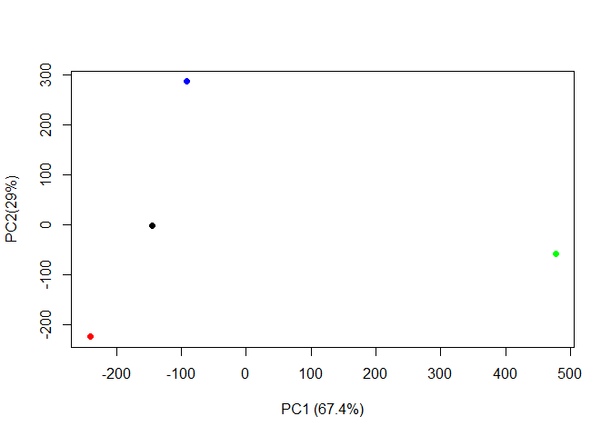

# Class 07: Machine Learning 1
Olivia Baldwin

Before we get into clustering methods let’s make some sample data to
cluster where we know what it should look like.

To help, I will use the `rnorm()` function.

``` r
hist(c(rnorm(15000, mean=-3), rnorm(15000, mean=3)))
```


``` r
n=30
x <- c(rnorm(n, mean=3), rnorm(n, mean=-3))
y <- rev(x)

z <- cbind(x,y)

#cbind = by column
#rbind = by row

plot(z)
```


\##K-means clustering The function in base R for k-means clustering is
called `kmeans()`. - argument “x” = input and “centers” = how many
clusers you want - “clusering vector” tells me which cluster each data
point belongs to -“sum of squares” tells me how far each point in
cluster are in the center/how tightly grouped (good) the cluster is

``` r
help(kmeans)
```

    starting httpd help server ... done

``` r
km <- kmeans(z, centers=2)
km
```

    K-means clustering with 2 clusters of sizes 30, 30

    Cluster means:
              x         y
    1 -2.780276  2.938778
    2  2.938778 -2.780276

    Clustering vector:
     [1] 2 2 2 2 2 2 2 2 2 2 2 2 2 2 2 2 2 2 2 2 2 2 2 2 2 2 2 2 2 2 1 1 1 1 1 1 1 1
    [39] 1 1 1 1 1 1 1 1 1 1 1 1 1 1 1 1 1 1 1 1 1 1

    Within cluster sum of squares by cluster:
    [1] 71.61068 71.61068
     (between_SS / total_SS =  87.3 %)

    Available components:

    [1] "cluster"      "centers"      "totss"        "withinss"     "tot.withinss"
    [6] "betweenss"    "size"         "iter"         "ifault"      

Can get to the “components” by printing them out like you would columns
(usuing a “\$”).

``` r
#examples of printing components

km$cluster
```

     [1] 2 2 2 2 2 2 2 2 2 2 2 2 2 2 2 2 2 2 2 2 2 2 2 2 2 2 2 2 2 2 1 1 1 1 1 1 1 1
    [39] 1 1 1 1 1 1 1 1 1 1 1 1 1 1 1 1 1 1 1 1 1 1

``` r
km$centers
```

              x         y
    1 -2.780276  2.938778
    2  2.938778 -2.780276

Plot Z with the clusters colored and add cluster centers:

``` r
plot(z, col= km$cluster)
points(km$centers, col="blue", pch=15, cex=2)
```


``` r
#pch changed the point type to the squares
#cex expanded the characters to size 2 instead of 1
```

Can you cluster our data in `z` into four clusters?

``` r
km4 <- kmeans(z, centers=4)
```

``` r
plot(z, col= km4$cluster)
points(km4$centers, col="blue", pch=15, cex=2)
```


``` r
#this clustering has no basis, usually use a "scree plot" to look for an inflection point to hint towards the most probably number of clusters (K) 
```

\##Hierarchical Clustering

The main function for hierarchical clustering is `hclust()`. - can do
top down or bottom up

Unlike `kmeans()` I cannot just pass in my data as an input, I first
need a distrance matrix from my data.

``` r
d <-dist(z)
hc <- hclust(d)
hc
```


    Call:
    hclust(d = d)

    Cluster method   : complete 
    Distance         : euclidean 
    Number of objects: 60 

There is a specific hclust plot() method…

``` r
plot(hc)
abline(h=10, col="red")
```


``` r
#the line represents where you would "cut" the branches
#cut branches in the "easiest" spot, meaning the tallest height to determine clusters
```

To get my clustering result (i.e. the membership vector) I can “cut” the
dendrogram at a given height. To do this I will use the `cutree()`
function.

``` r
groups <- cutree(hc, h=10)
plot(z, col=groups) 
```


# Principal Component Analysis

“Principal component analysis (PCA) is a well established”multivariate
statistical technique” used to reduce the dimensionality of a complex
data set to a more manageable number (typically 2D or 3D). This method
is particularly useful for highlighting strong paterns and relationships
in large datasets (i.e. revealing major similarities and diferences)
that are otherwise hard to visualize.”

## PCA for UK foods

``` r
url <- "https://tinyurl.com/UK-foods"
uk <- read.csv(url)
```

> Q1: 17 rows and 5 columns

``` r
dim(uk)
```

    [1] 17  5

``` r
head(uk)
```

                   X England Wales Scotland N.Ireland
    1         Cheese     105   103      103        66
    2  Carcass_meat      245   227      242       267
    3    Other_meat      685   803      750       586
    4           Fish     147   160      122        93
    5 Fats_and_oils      193   235      184       209
    6         Sugars     156   175      147       139

``` r
uk <- read.csv(url, row.names=1)
uk
```

                        England Wales Scotland N.Ireland
    Cheese                  105   103      103        66
    Carcass_meat            245   227      242       267
    Other_meat              685   803      750       586
    Fish                    147   160      122        93
    Fats_and_oils           193   235      184       209
    Sugars                  156   175      147       139
    Fresh_potatoes          720   874      566      1033
    Fresh_Veg               253   265      171       143
    Other_Veg               488   570      418       355
    Processed_potatoes      198   203      220       187
    Processed_Veg           360   365      337       334
    Fresh_fruit            1102  1137      957       674
    Cereals                1472  1582     1462      1494
    Beverages                57    73       53        47
    Soft_drinks            1374  1256     1572      1506
    Alcoholic_drinks        375   475      458       135
    Confectionery            54    64       62        41

> Q2: I like the alternate option better to set the row names when you
> import so you don’t have to override the variable.

Barplot:

``` r
barplot(as.matrix(uk), beside=T, col=rainbow(nrow(uk)))
```


> Q3: Changing the beside argument will change the barplot.

``` r
barplot(as.matrix(uk), beside=FALSE, col=rainbow(nrow(uk)))
```


> Q5: each y axis is aligned to the country in its row and being on the
> diagonal means the other country on each x matches the country on the
> y.

``` r
pairs(uk, col=rainbow(10), pch=16)
```


> Q6: There are several points that are very different in the N.Ireland
> row (i.e. light blue, yellow, green, and orange that are higher on the
> x axis)

\##PCA to the rescue

The main function to do PCA in base R is `prcomp()`.

Note that I need to take the transpose of this particular data as that
is what the `prcomp()` help page asked for.

``` r
pca <- prcomp( t(uk) )
summary(pca)
```

    Importance of components:
                                PC1      PC2      PC3       PC4
    Standard deviation     324.1502 212.7478 73.87622 3.176e-14
    Proportion of Variance   0.6744   0.2905  0.03503 0.000e+00
    Cumulative Proportion    0.6744   0.9650  1.00000 1.000e+00

Lets see what is inside our result object `pca` that we just calculated.

``` r
attributes(pca)
```

    $names
    [1] "sdev"     "rotation" "center"   "scale"    "x"       

    $class
    [1] "prcomp"

``` r
pca$x
```

                     PC1         PC2        PC3           PC4
    England   -144.99315   -2.532999 105.768945 -4.894696e-14
    Wales     -240.52915 -224.646925 -56.475555  5.700024e-13
    Scotland   -91.86934  286.081786 -44.415495 -7.460785e-13
    N.Ireland  477.39164  -58.901862  -4.877895  2.321303e-13

To make our main result figure, called a “PC plot” (or score plot or
ordination plot or PC1 vs. PC2).

``` r
plot(pca$x[,1], pca$x[,2], col=c("black", "red", "blue", "green"), pch=16, xlab="PC1 (67.4%)", ylab="PC2(29%)")
```



``` r
#this will access the first and second column of the PC table output (a.k.a. PC1 and PC2)
```

## Variable Loadings Plot

This plot can show how these countries differ from each other. The
positive means it is moving towards the positive end of PCA1.

``` r
## Lets focus on PC1 as it accounts for > 90% of variance 
par(mar=c(10, 3, 0.35, 0))
barplot( pca$rotation[,1], las=2 )
```


