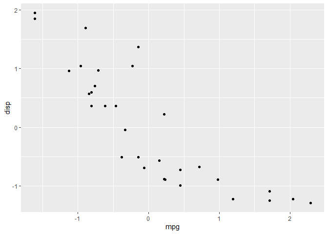
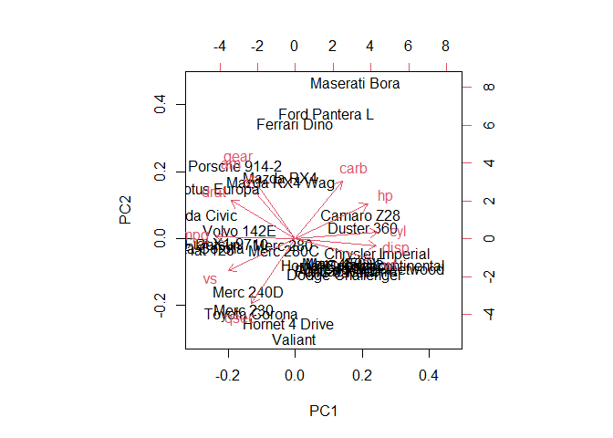
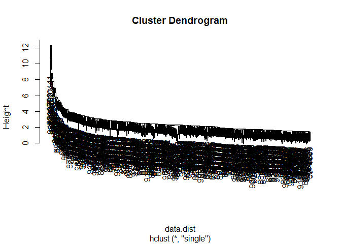
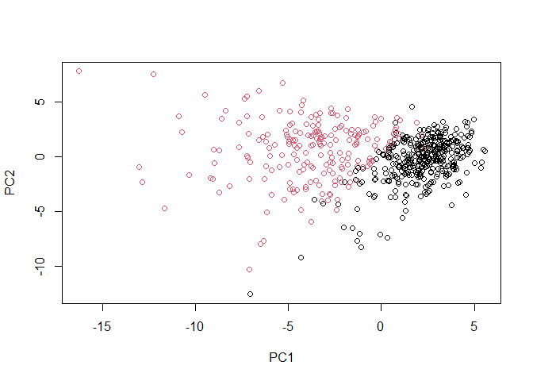

# Class 8: PCA Mini Project
Olivia Baldwin

Side Note:

Let’s look at the mean value of every column in the `mtcars` dataset.

``` r
apply(mtcars, 2, mean) 
```

           mpg        cyl       disp         hp       drat         wt       qsec 
     20.090625   6.187500 230.721875 146.687500   3.596563   3.217250  17.848750 
            vs         am       gear       carb 
      0.437500   0.406250   3.687500   2.812500 

``` r
#'2' is for colunms, '1' is for rows for the middle argument
```

Let’s look at “spread” via `sd()`.

``` r
apply(mtcars, 2, sd)
```

            mpg         cyl        disp          hp        drat          wt 
      6.0269481   1.7859216 123.9386938  68.5628685   0.5346787   0.9784574 
           qsec          vs          am        gear        carb 
      1.7869432   0.5040161   0.4989909   0.7378041   1.6152000 

If we do a PCA without scaling then the PCA will pick up the columns
with the most spread (for this example: disp and hp)

``` r
pca <- prcomp(mtcars)
biplot(pca)
```


Let’s try it again with scaling

``` r
mtscale <- scale(mtcars)
head(mtscale)
```

                             mpg        cyl        disp         hp       drat
    Mazda RX4          0.1508848 -0.1049878 -0.57061982 -0.5350928  0.5675137
    Mazda RX4 Wag      0.1508848 -0.1049878 -0.57061982 -0.5350928  0.5675137
    Datsun 710         0.4495434 -1.2248578 -0.99018209 -0.7830405  0.4739996
    Hornet 4 Drive     0.2172534 -0.1049878  0.22009369 -0.5350928 -0.9661175
    Hornet Sportabout -0.2307345  1.0148821  1.04308123  0.4129422 -0.8351978
    Valiant           -0.3302874 -0.1049878 -0.04616698 -0.6080186 -1.5646078
                                wt       qsec         vs         am       gear
    Mazda RX4         -0.610399567 -0.7771651 -0.8680278  1.1899014  0.4235542
    Mazda RX4 Wag     -0.349785269 -0.4637808 -0.8680278  1.1899014  0.4235542
    Datsun 710        -0.917004624  0.4260068  1.1160357  1.1899014  0.4235542
    Hornet 4 Drive    -0.002299538  0.8904872  1.1160357 -0.8141431 -0.9318192
    Hornet Sportabout  0.227654255 -0.4637808 -0.8680278 -0.8141431 -0.9318192
    Valiant            0.248094592  1.3269868  1.1160357 -0.8141431 -0.9318192
                            carb
    Mazda RX4          0.7352031
    Mazda RX4 Wag      0.7352031
    Datsun 710        -1.1221521
    Hornet 4 Drive    -1.1221521
    Hornet Sportabout -0.5030337
    Valiant           -1.1221521

``` r
round(apply(mtscale, 2, mean), 3) 
```

     mpg  cyl disp   hp drat   wt qsec   vs   am gear carb 
       0    0    0    0    0    0    0    0    0    0    0 

``` r
apply(mtscale, 2, sd)
```

     mpg  cyl disp   hp drat   wt qsec   vs   am gear carb 
       1    1    1    1    1    1    1    1    1    1    1 

Let’s plot mpg vs disp to see if the data relationships change. (they
don’t)

``` r
library(ggplot2)

#plot mpg vs. disp for mtcars and mtscale
ggplot(mtcars, aes(mpg, disp)) + geom_point()
```


``` r
ggplot(mtscale, aes(mpg, disp)) + geom_point()
```



Let’s rerun the PCA with scaled data.

``` r
pca2 <- prcomp(mtscale)
biplot(pca2)
```



## Breast Cancer FNA Data

``` r
fna.data <- "WisconsinCancer.csv"

wisc.df <- read.csv(fna.data, row.names = 1)
head(wisc.df)
```

             diagnosis radius_mean texture_mean perimeter_mean area_mean
    842302           M       17.99        10.38         122.80    1001.0
    842517           M       20.57        17.77         132.90    1326.0
    84300903         M       19.69        21.25         130.00    1203.0
    84348301         M       11.42        20.38          77.58     386.1
    84358402         M       20.29        14.34         135.10    1297.0
    843786           M       12.45        15.70          82.57     477.1
             smoothness_mean compactness_mean concavity_mean concave.points_mean
    842302           0.11840          0.27760         0.3001             0.14710
    842517           0.08474          0.07864         0.0869             0.07017
    84300903         0.10960          0.15990         0.1974             0.12790
    84348301         0.14250          0.28390         0.2414             0.10520
    84358402         0.10030          0.13280         0.1980             0.10430
    843786           0.12780          0.17000         0.1578             0.08089
             symmetry_mean fractal_dimension_mean radius_se texture_se perimeter_se
    842302          0.2419                0.07871    1.0950     0.9053        8.589
    842517          0.1812                0.05667    0.5435     0.7339        3.398
    84300903        0.2069                0.05999    0.7456     0.7869        4.585
    84348301        0.2597                0.09744    0.4956     1.1560        3.445
    84358402        0.1809                0.05883    0.7572     0.7813        5.438
    843786          0.2087                0.07613    0.3345     0.8902        2.217
             area_se smoothness_se compactness_se concavity_se concave.points_se
    842302    153.40      0.006399        0.04904      0.05373           0.01587
    842517     74.08      0.005225        0.01308      0.01860           0.01340
    84300903   94.03      0.006150        0.04006      0.03832           0.02058
    84348301   27.23      0.009110        0.07458      0.05661           0.01867
    84358402   94.44      0.011490        0.02461      0.05688           0.01885
    843786     27.19      0.007510        0.03345      0.03672           0.01137
             symmetry_se fractal_dimension_se radius_worst texture_worst
    842302       0.03003             0.006193        25.38         17.33
    842517       0.01389             0.003532        24.99         23.41
    84300903     0.02250             0.004571        23.57         25.53
    84348301     0.05963             0.009208        14.91         26.50
    84358402     0.01756             0.005115        22.54         16.67
    843786       0.02165             0.005082        15.47         23.75
             perimeter_worst area_worst smoothness_worst compactness_worst
    842302            184.60     2019.0           0.1622            0.6656
    842517            158.80     1956.0           0.1238            0.1866
    84300903          152.50     1709.0           0.1444            0.4245
    84348301           98.87      567.7           0.2098            0.8663
    84358402          152.20     1575.0           0.1374            0.2050
    843786            103.40      741.6           0.1791            0.5249
             concavity_worst concave.points_worst symmetry_worst
    842302            0.7119               0.2654         0.4601
    842517            0.2416               0.1860         0.2750
    84300903          0.4504               0.2430         0.3613
    84348301          0.6869               0.2575         0.6638
    84358402          0.4000               0.1625         0.2364
    843786            0.5355               0.1741         0.3985
             fractal_dimension_worst  X
    842302                   0.11890 NA
    842517                   0.08902 NA
    84300903                 0.08758 NA
    84348301                 0.17300 NA
    84358402                 0.07678 NA
    843786                   0.12440 NA

``` r
wisc.data <- wisc.df[,-1]
wisc.data <- wisc.data[,-31]
View(wisc.data)
```

``` r
diagnosis <- as.factor(wisc.df$diagnosis)
```

> Q1: 569 patients (rows) and 30 observations (columns, minus the
> diagnosis and “X” that we took out, so if included it is 32)

> Q2: 212 patients are “M” for malignant

> Q3: There are 10 column names (features) in the dataset that end in
> “\_mean”

``` r
dim(wisc.data)
```

    [1] 569  30

``` r
table(diagnosis)
```

    diagnosis
      B   M 
    357 212 

``` r
length(grep("_mean", colnames(wisc.data))) 
```

    [1] 10

``` r
round(apply(wisc.data, 2, mean), 3)
```

                radius_mean            texture_mean          perimeter_mean 
                     14.127                  19.290                  91.969 
                  area_mean         smoothness_mean        compactness_mean 
                    654.889                   0.096                   0.104 
             concavity_mean     concave.points_mean           symmetry_mean 
                      0.089                   0.049                   0.181 
     fractal_dimension_mean               radius_se              texture_se 
                      0.063                   0.405                   1.217 
               perimeter_se                 area_se           smoothness_se 
                      2.866                  40.337                   0.007 
             compactness_se            concavity_se       concave.points_se 
                      0.025                   0.032                   0.012 
                symmetry_se    fractal_dimension_se            radius_worst 
                      0.021                   0.004                  16.269 
              texture_worst         perimeter_worst              area_worst 
                     25.677                 107.261                 880.583 
           smoothness_worst       compactness_worst         concavity_worst 
                      0.132                   0.254                   0.272 
       concave.points_worst          symmetry_worst fractal_dimension_worst 
                      0.115                   0.290                   0.084 

``` r
round(apply(wisc.data,2,sd), 3)
```

                radius_mean            texture_mean          perimeter_mean 
                      3.524                   4.301                  24.299 
                  area_mean         smoothness_mean        compactness_mean 
                    351.914                   0.014                   0.053 
             concavity_mean     concave.points_mean           symmetry_mean 
                      0.080                   0.039                   0.027 
     fractal_dimension_mean               radius_se              texture_se 
                      0.007                   0.277                   0.552 
               perimeter_se                 area_se           smoothness_se 
                      2.022                  45.491                   0.003 
             compactness_se            concavity_se       concave.points_se 
                      0.018                   0.030                   0.006 
                symmetry_se    fractal_dimension_se            radius_worst 
                      0.008                   0.003                   4.833 
              texture_worst         perimeter_worst              area_worst 
                      6.146                  33.603                 569.357 
           smoothness_worst       compactness_worst         concavity_worst 
                      0.023                   0.157                   0.209 
       concave.points_worst          symmetry_worst fractal_dimension_worst 
                      0.066                   0.062                   0.018 

**PCA** We should scale the data based on the means and sd of the
dataset being very different.

``` r
wisc.pr <- prcomp(wisc.data, scale=TRUE)
summary <- summary(wisc.pr)
summary
```

    Importance of components:
                              PC1    PC2     PC3     PC4     PC5     PC6     PC7
    Standard deviation     3.6444 2.3857 1.67867 1.40735 1.28403 1.09880 0.82172
    Proportion of Variance 0.4427 0.1897 0.09393 0.06602 0.05496 0.04025 0.02251
    Cumulative Proportion  0.4427 0.6324 0.72636 0.79239 0.84734 0.88759 0.91010
                               PC8    PC9    PC10   PC11    PC12    PC13    PC14
    Standard deviation     0.69037 0.6457 0.59219 0.5421 0.51104 0.49128 0.39624
    Proportion of Variance 0.01589 0.0139 0.01169 0.0098 0.00871 0.00805 0.00523
    Cumulative Proportion  0.92598 0.9399 0.95157 0.9614 0.97007 0.97812 0.98335
                              PC15    PC16    PC17    PC18    PC19    PC20   PC21
    Standard deviation     0.30681 0.28260 0.24372 0.22939 0.22244 0.17652 0.1731
    Proportion of Variance 0.00314 0.00266 0.00198 0.00175 0.00165 0.00104 0.0010
    Cumulative Proportion  0.98649 0.98915 0.99113 0.99288 0.99453 0.99557 0.9966
                              PC22    PC23   PC24    PC25    PC26    PC27    PC28
    Standard deviation     0.16565 0.15602 0.1344 0.12442 0.09043 0.08307 0.03987
    Proportion of Variance 0.00091 0.00081 0.0006 0.00052 0.00027 0.00023 0.00005
    Cumulative Proportion  0.99749 0.99830 0.9989 0.99942 0.99969 0.99992 0.99997
                              PC29    PC30
    Standard deviation     0.02736 0.01153
    Proportion of Variance 0.00002 0.00000
    Cumulative Proportion  1.00000 1.00000

Scree Plot:

``` r
plot(summary$importance[2,], typ="b")
```


> Q4: The first PCA captures 44.27% of the total variance.

> Q5: By PCA3, over 70% of the variance is captured.

> Q6: By PCA7, over 90% of the variance is captured.

``` r
biplot(wisc.pr)
```


> Q7: This plot is very hard to read. Even making it bigger, there are
> too many data points listed as large numbers that overlap making it
> uninterpretable. Also, all 30 of the axis are included, and those are
> just as hard to read.

Main PC result plot:

``` r
plot(wisc.pr$x, col = diagnosis, 
     xlab = "PC1", ylab = "PC2")
```


> Q8: The red points (malignant) are generally towards the left (in the
> negative of PC1) and the black points (benign) are generally towards
> the right (in the positive of PC1).

Plot of PC1 vs PC3:

``` r
plot(wisc.pr$x[, 1], wisc.pr$x[, 3], col = diagnosis, 
     xlab = "PC1", ylab = "PC3")
```


Use ggplot to make a scatter plot of the PCA data.

``` r
df <- as.data.frame(wisc.pr$x)
df$diagnosis <- diagnosis

library(ggplot2)

ggplot(df) + 
  aes(PC1, PC2, col=diagnosis) + 
  geom_point()
```


**Variance**

``` r
pr.var <- wisc.pr$sdev^2
head(pr.var)
```

    [1] 13.281608  5.691355  2.817949  1.980640  1.648731  1.207357

``` r
pve <- pr.var / sum(pr.var)
head(pve)
```

    [1] 0.44272026 0.18971182 0.09393163 0.06602135 0.05495768 0.04024522

``` r
plot(pve, xlab = "Principal Component", 
     ylab = "Proportion of Variance Explained", 
     ylim = c(0, 1), type = "o")
```


Alternative scree plot

``` r
barplot(pve, ylab = "Precent of Variance Explained",
     names.arg=paste0("PC",1:length(pve)), las=2, axes = FALSE)
axis(2, at=pve, labels=round(pve,2)*100 )
```


> Q9: -0.261 is the concave.points_means value for the first principle
> component. The first component is important since the number is higher
> than others (neg/pos doesn’t matter). By looking at other components,
> they are closer to 0 (at least for the 2, 3, and 4 that I checked).
> Higher the value means that it is more important/has more influence
> than the others.

``` r
round(wisc.pr$rotation[,1], 3)
```

                radius_mean            texture_mean          perimeter_mean 
                     -0.219                  -0.104                  -0.228 
                  area_mean         smoothness_mean        compactness_mean 
                     -0.221                  -0.143                  -0.239 
             concavity_mean     concave.points_mean           symmetry_mean 
                     -0.258                  -0.261                  -0.138 
     fractal_dimension_mean               radius_se              texture_se 
                     -0.064                  -0.206                  -0.017 
               perimeter_se                 area_se           smoothness_se 
                     -0.211                  -0.203                  -0.015 
             compactness_se            concavity_se       concave.points_se 
                     -0.170                  -0.154                  -0.183 
                symmetry_se    fractal_dimension_se            radius_worst 
                     -0.042                  -0.103                  -0.228 
              texture_worst         perimeter_worst              area_worst 
                     -0.104                  -0.237                  -0.225 
           smoothness_worst       compactness_worst         concavity_worst 
                     -0.128                  -0.210                  -0.229 
       concave.points_worst          symmetry_worst fractal_dimension_worst 
                     -0.251                  -0.123                  -0.132 

``` r
round(wisc.pr$rotation[,4], 3)
```

                radius_mean            texture_mean          perimeter_mean 
                      0.041                  -0.603                   0.042 
                  area_mean         smoothness_mean        compactness_mean 
                      0.053                   0.159                   0.032 
             concavity_mean     concave.points_mean           symmetry_mean 
                      0.019                   0.065                   0.067 
     fractal_dimension_mean               radius_se              texture_se 
                      0.049                   0.098                  -0.360 
               perimeter_se                 area_se           smoothness_se 
                      0.089                   0.108                   0.045 
             compactness_se            concavity_se       concave.points_se 
                     -0.027                   0.001                   0.074 
                symmetry_se    fractal_dimension_se            radius_worst 
                      0.044                   0.015                   0.015 
              texture_worst         perimeter_worst              area_worst 
                     -0.633                   0.014                   0.026 
           smoothness_worst       compactness_worst         concavity_worst 
                      0.018                  -0.091                  -0.074 
       concave.points_worst          symmetry_worst fractal_dimension_worst 
                      0.006                  -0.036                  -0.077 

**Hierarchical Clustering**

Scale the data, then calculate the Euclidean distance and create
clusters.

``` r
data.scaled <- scale(wisc.data)

data.dist <- dist(data.scaled)

wisc.hclust <- hclust(data.dist, method="complete") 
```

> Q10: There are 4 clusters at a height of about 19.

``` r
plot(wisc.hclust)
abline(h=19, col="red", lty=2)
```


``` r
wisc.hclust.clusters <- cutree(wisc.hclust, 4)

table(wisc.hclust.clusters, diagnosis)
```

                        diagnosis
    wisc.hclust.clusters   B   M
                       1  12 165
                       2   2   5
                       3 343  40
                       4   0   2

> Q12: The ward.D2 is the best because it has two clear, tall “goal
> posts” that seperate clear clusters.

``` r
hclust_single <- hclust(data.dist, method="single")
hclust_average <- hclust(data.dist, method="average")
hclust_ward <- hclust(data.dist, method="ward.D2")

plot(hclust_single)
```



``` r
plot(hclust_average)
```


``` r
plot(hclust_ward)
```


**Combining Methods**

Use PCA results to include the number of PCs needed to describe *90%* of
the variance and link with the ward.D2 method.

``` r
dist7 <- dist(wisc.pr$x[,1:7])
wisc.pr.hclust <- hclust(dist7, method="ward.D2")
plot(wisc.pr.hclust)
abline(h=60, col="red", lty=2)
```


``` r
grps <- cutree(wisc.pr.hclust, k=2)
table(grps, diagnosis)
```

        diagnosis
    grps   B   M
       1  28 188
       2 329  24

``` r
plot(wisc.pr$x[,1:2], col=grps)
```


``` r
plot(wisc.pr$x[,1:2], col=diagnosis)
```



3D Graph (graph shows up as pop up):

``` r
library(rgl)
plot3d(wisc.pr$x[,1:3], xlab="PC 1", ylab="PC 2", zlab="PC 3", cex=1.5, size=1, type="s", col=grps)
```

The colors switched on the 2D plots, and can be edited if convert grps
to factor and rearrange the order. Both the grps graph and diagnosis are
showing similar patterns.

``` r
g <- as.factor(grps)
g <- relevel(g,2)
plot(wisc.pr$x[,1:2], col=g)
```


Cut the model into 2 clusters:

``` r
wisc.pr.hclust.clusters <- cutree(wisc.pr.hclust, k=2)
table(wisc.pr.hclust.clusters, diagnosis)
```

                           diagnosis
    wisc.pr.hclust.clusters   B   M
                          1  28 188
                          2 329  24

> Q13: It does ok, there are still about 60 misdiagnoses in model.
> Which, when talking about cancer, close to 60 wrong diagnosis is a big
> deal.

``` r
table(wisc.hclust.clusters, diagnosis)
```

                        diagnosis
    wisc.hclust.clusters   B   M
                       1  12 165
                       2   2   5
                       3 343  40
                       4   0   2

``` r
table(diagnosis, grps)
```

             grps
    diagnosis   1   2
            B  28 329
            M 188  24

> Q14: The non-PCA models are even worse, especially when cut into 4
> groups. This would not be helpful at all in diagnosis. In groups 2 and
> 4, they are so small and cluster 2 is split very unhelpfully.

**Prediction**

Load in a new data set. Use the wisc data set to predict diagnosis.

``` r
url <- "https://tinyurl.com/new-samples-CSV"
new <- read.csv(url)
npc <- predict(wisc.pr, newdata=new)
npc
```

               PC1       PC2        PC3        PC4       PC5        PC6        PC7
    [1,]  2.576616 -3.135913  1.3990492 -0.7631950  2.781648 -0.8150185 -0.3959098
    [2,] -4.754928 -3.009033 -0.1660946 -0.6052952 -1.140698 -1.2189945  0.8193031
                PC8       PC9       PC10      PC11      PC12      PC13     PC14
    [1,] -0.2307350 0.1029569 -0.9272861 0.3411457  0.375921 0.1610764 1.187882
    [2,] -0.3307423 0.5281896 -0.4855301 0.7173233 -1.185917 0.5893856 0.303029
              PC15       PC16        PC17        PC18        PC19       PC20
    [1,] 0.3216974 -0.1743616 -0.07875393 -0.11207028 -0.08802955 -0.2495216
    [2,] 0.1299153  0.1448061 -0.40509706  0.06565549  0.25591230 -0.4289500
               PC21       PC22       PC23       PC24        PC25         PC26
    [1,]  0.1228233 0.09358453 0.08347651  0.1223396  0.02124121  0.078884581
    [2,] -0.1224776 0.01732146 0.06316631 -0.2338618 -0.20755948 -0.009833238
                 PC27        PC28         PC29         PC30
    [1,]  0.220199544 -0.02946023 -0.015620933  0.005269029
    [2,] -0.001134152  0.09638361  0.002795349 -0.019015820

Plot the PCA for the new data. The blue points label the 2 new patients.
The colors are divided by the groups created earlier for the wisc data.

``` r
plot(wisc.pr$x[,1:2], col=g)
points(npc[,1], npc[,2], col="blue", pch=16, cex=3)
text(npc[,1], npc[,2], c(1,2), col="white")
```


> Q16: Based on our model, patient 2 should be prioritized as they are
> more similar to the “malignant” group from out training data (wisc).
