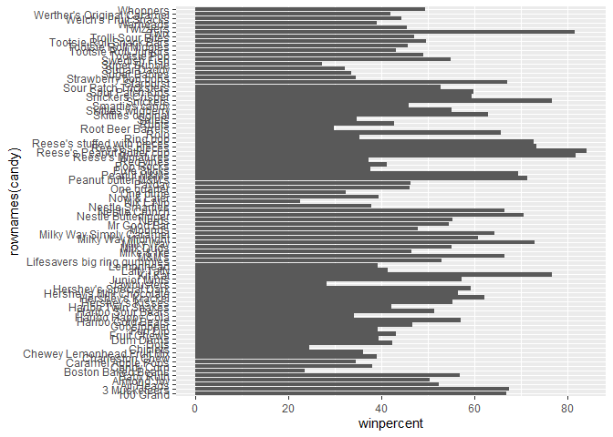
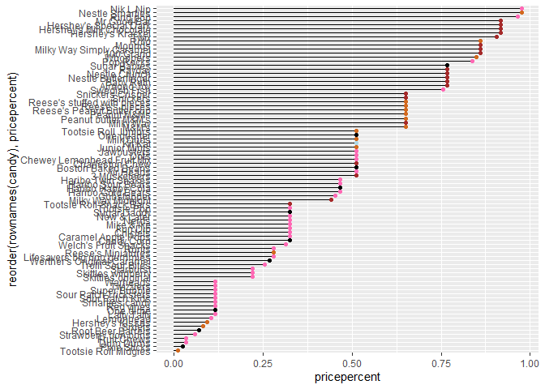

# Class 9: Halloween Mini Project
Olivia Baldwin

``` r
candy <- read.csv("candy-data.csv", row.names = 1) 
head(candy)
```

                 chocolate fruity caramel peanutyalmondy nougat crispedricewafer
    100 Grand            1      0       1              0      0                1
    3 Musketeers         1      0       0              0      1                0
    One dime             0      0       0              0      0                0
    One quarter          0      0       0              0      0                0
    Air Heads            0      1       0              0      0                0
    Almond Joy           1      0       0              1      0                0
                 hard bar pluribus sugarpercent pricepercent winpercent
    100 Grand       0   1        0        0.732        0.860   66.97173
    3 Musketeers    0   1        0        0.604        0.511   67.60294
    One dime        0   0        0        0.011        0.116   32.26109
    One quarter     0   0        0        0.011        0.511   46.11650
    Air Heads       0   0        0        0.906        0.511   52.34146
    Almond Joy      0   1        0        0.465        0.767   50.34755

``` r
dim(candy)
```

    [1] 85 12

``` r
table(candy$fruity)
```


     0  1 
    47 38 

> Q1: There are 85 different types of candy (rows)

> Q2: There are 38 “fruity” candies.

``` r
candy["Kit Kat", ]$winpercent
```

    [1] 76.7686

``` r
candy["Tootsie Roll Snack Bars", ]$winpercent
```

    [1] 49.6535

> Q3: I like kit kats and their win percentage is 76.77%

> Q4: Kit kat has a win percentage of 76.77%

> Q5: Tootsie roll snack bars have a win percentage of 49.65%

``` r
library("skimr")
skim(candy)
```

|                                                  |       |
|:-------------------------------------------------|:------|
| Name                                             | candy |
| Number of rows                                   | 85    |
| Number of columns                                | 12    |
| \_\_\_\_\_\_\_\_\_\_\_\_\_\_\_\_\_\_\_\_\_\_\_   |       |
| Column type frequency:                           |       |
| numeric                                          | 12    |
| \_\_\_\_\_\_\_\_\_\_\_\_\_\_\_\_\_\_\_\_\_\_\_\_ |       |
| Group variables                                  | None  |

Data summary

**Variable type: numeric**

| skim_variable | n_missing | complete_rate | mean | sd | p0 | p25 | p50 | p75 | p100 | hist |
|:---|---:|---:|---:|---:|---:|---:|---:|---:|---:|:---|
| chocolate | 0 | 1 | 0.44 | 0.50 | 0.00 | 0.00 | 0.00 | 1.00 | 1.00 | ▇▁▁▁▆ |
| fruity | 0 | 1 | 0.45 | 0.50 | 0.00 | 0.00 | 0.00 | 1.00 | 1.00 | ▇▁▁▁▆ |
| caramel | 0 | 1 | 0.16 | 0.37 | 0.00 | 0.00 | 0.00 | 0.00 | 1.00 | ▇▁▁▁▂ |
| peanutyalmondy | 0 | 1 | 0.16 | 0.37 | 0.00 | 0.00 | 0.00 | 0.00 | 1.00 | ▇▁▁▁▂ |
| nougat | 0 | 1 | 0.08 | 0.28 | 0.00 | 0.00 | 0.00 | 0.00 | 1.00 | ▇▁▁▁▁ |
| crispedricewafer | 0 | 1 | 0.08 | 0.28 | 0.00 | 0.00 | 0.00 | 0.00 | 1.00 | ▇▁▁▁▁ |
| hard | 0 | 1 | 0.18 | 0.38 | 0.00 | 0.00 | 0.00 | 0.00 | 1.00 | ▇▁▁▁▂ |
| bar | 0 | 1 | 0.25 | 0.43 | 0.00 | 0.00 | 0.00 | 0.00 | 1.00 | ▇▁▁▁▂ |
| pluribus | 0 | 1 | 0.52 | 0.50 | 0.00 | 0.00 | 1.00 | 1.00 | 1.00 | ▇▁▁▁▇ |
| sugarpercent | 0 | 1 | 0.48 | 0.28 | 0.01 | 0.22 | 0.47 | 0.73 | 0.99 | ▇▇▇▇▆ |
| pricepercent | 0 | 1 | 0.47 | 0.29 | 0.01 | 0.26 | 0.47 | 0.65 | 0.98 | ▇▇▇▇▆ |
| winpercent | 0 | 1 | 50.32 | 14.71 | 22.45 | 39.14 | 47.83 | 59.86 | 84.18 | ▃▇▆▅▂ |

> Q6: Win percentage seems to be on a different scale because its
> standard deviation is about 14, but all of the others are less than
> one.

> Q7: The “0” in the chocolate column means there is no chocolate in the
> candy and the “1” means it contains chocolate.

> Q8:

``` r
hist(candy$winpercent)
```


> Q9: The distribution of the win percentage is not symmetrical.

> Q10: The center of the distribution is below 50%.

``` r
chocolate_winperc <- candy$winpercent[as.logical(candy$chocolate)]
mean(chocolate_winperc)
```

    [1] 60.92153

``` r
fruity_winperc <- candy$winpercent[as.logical(candy$fruity)]
mean(fruity_winperc)
```

    [1] 44.11974

> Q11: On average the chocolate win percentage is higher than the
> fruity.

``` r
t.test(chocolate_winperc, fruity_winperc)
```


        Welch Two Sample t-test

    data:  chocolate_winperc and fruity_winperc
    t = 6.2582, df = 68.882, p-value = 2.871e-08
    alternative hypothesis: true difference in means is not equal to 0
    95 percent confidence interval:
     11.44563 22.15795
    sample estimates:
    mean of x mean of y 
     60.92153  44.11974 

> Q12: According to a basic, two sample t-test, they are statistically
> significant with a p-value of 2.87e-8.

``` r
#lets try dplyr for this one
library(dplyr)
```


    Attaching package: 'dplyr'

    The following objects are masked from 'package:stats':

        filter, lag

    The following objects are masked from 'package:base':

        intersect, setdiff, setequal, union

``` r
candy |>
  arrange(winpercent) |>
  head(5)
```

                       chocolate fruity caramel peanutyalmondy nougat
    Nik L Nip                  0      1       0              0      0
    Boston Baked Beans         0      0       0              1      0
    Chiclets                   0      1       0              0      0
    Super Bubble               0      1       0              0      0
    Jawbusters                 0      1       0              0      0
                       crispedricewafer hard bar pluribus sugarpercent pricepercent
    Nik L Nip                         0    0   0        1        0.197        0.976
    Boston Baked Beans                0    0   0        1        0.313        0.511
    Chiclets                          0    0   0        1        0.046        0.325
    Super Bubble                      0    0   0        0        0.162        0.116
    Jawbusters                        0    1   0        1        0.093        0.511
                       winpercent
    Nik L Nip            22.44534
    Boston Baked Beans   23.41782
    Chiclets             24.52499
    Super Bubble         27.30386
    Jawbusters           28.12744

``` r
candy |>
  arrange(desc(winpercent)) |>
  head(5)
```

                              chocolate fruity caramel peanutyalmondy nougat
    Reese's Peanut Butter cup         1      0       0              1      0
    Reese's Miniatures                1      0       0              1      0
    Twix                              1      0       1              0      0
    Kit Kat                           1      0       0              0      0
    Snickers                          1      0       1              1      1
                              crispedricewafer hard bar pluribus sugarpercent
    Reese's Peanut Butter cup                0    0   0        0        0.720
    Reese's Miniatures                       0    0   0        0        0.034
    Twix                                     1    0   1        0        0.546
    Kit Kat                                  1    0   1        0        0.313
    Snickers                                 0    0   1        0        0.546
                              pricepercent winpercent
    Reese's Peanut Butter cup        0.651   84.18029
    Reese's Miniatures               0.279   81.86626
    Twix                             0.906   81.64291
    Kit Kat                          0.511   76.76860
    Snickers                         0.651   76.67378

> Q13: The bottom 5 are: jawbusters, super bubble, chiclets, boston
> baked beans, and nik l nip

> Q14: The top 5 are: reese’s peanut butter cups, reese’s miniatures,
> twix, kit kat, and snickers

> Q15:

``` r
library(ggplot2)
```

``` r
ggplot(candy) +
  aes(winpercent, rownames(candy)) +
  geom_col()
```



``` r
ggplot(candy) +
  aes(winpercent, reorder(rownames(candy), winpercent)) +
  geom_col()
```


``` r
my_cols=rep("black", nrow(candy))
my_cols[as.logical(candy$chocolate)] = "chocolate"
my_cols[as.logical(candy$bar)] = "brown"
my_cols[as.logical(candy$fruity)] = "hotpink"
my_cols[rownames(candy)=="Kit Kat"] = "lightblue"
```

``` r
ggplot(candy) +
  aes(winpercent, reorder(rownames(candy), winpercent)) +
  geom_col(fill=my_cols)
```


> Q17: The worst ranked chocolate candy is Sixlets.

> Q18: The best ranked fruity candy is Starbursts.

``` r
library(ggrepel)
```

``` r
ggplot(candy) +
  aes(winpercent, pricepercent, label=rownames(candy)) +
  geom_point(col=my_cols) +
  geom_text_repel(col=my_cols, size=2.5, max.overlaps = 16)
```


``` r
#changed the size and overlaps so that all could be included with labels
#geom_text_repel is better than geom_text for lots of points because it reduces overlaps of words
```

> Q19: The highest win percentage for the lowest price is probably
> reese’s minis because it has a win percent over 80%, but is close to
> the 25% price percentage, which is fairly low.

> Q20: The top 5 most expensive are: Nik l nip, ring pops, smarties,
> hershey krackel and hershey milk chocolate. The nik l nip is the least
> popular.

``` r
candy |>
  arrange(desc(pricepercent)) |>
  head(5)
```

                             chocolate fruity caramel peanutyalmondy nougat
    Nik L Nip                        0      1       0              0      0
    Nestle Smarties                  1      0       0              0      0
    Ring pop                         0      1       0              0      0
    Hershey's Krackel                1      0       0              0      0
    Hershey's Milk Chocolate         1      0       0              0      0
                             crispedricewafer hard bar pluribus sugarpercent
    Nik L Nip                               0    0   0        1        0.197
    Nestle Smarties                         0    0   0        1        0.267
    Ring pop                                0    1   0        0        0.732
    Hershey's Krackel                       1    0   1        0        0.430
    Hershey's Milk Chocolate                0    0   1        0        0.430
                             pricepercent winpercent
    Nik L Nip                       0.976   22.44534
    Nestle Smarties                 0.976   37.88719
    Ring pop                        0.965   35.29076
    Hershey's Krackel               0.918   62.28448
    Hershey's Milk Chocolate        0.918   56.49050

> Q21:

``` r
ggplot(candy) +
  aes(pricepercent, reorder(rownames(candy), pricepercent)) +
  geom_col()
```


``` r
ggplot(candy) +
  aes(pricepercent, reorder(rownames(candy), pricepercent)) +
  geom_segment(aes(yend=reorder(rownames(candy), pricepercent), 
                   xend=0)) +
  geom_point(col=my_cols)
```



``` r
library(corrplot) 
```

    corrplot 0.95 loaded

``` r
cij <- cor(candy) 
corrplot(cij)
```


> Q22: The most anti-correlated would be chocolate and fruity (not a lot
> of candy is both). The pluribus and bar are also anti-correlated
> (which makes sense because most of the time you don’t get more than
> one bar of candy per serving). I can tell by the size and redness of
> the dots.

> Q23: Chocolate and winpercent are very correlated. Chocolate and bar
> are also very correlated. Same with chocolate and pricepercent, as
> well as bar and pricepercent.

``` r
noscale_pca <- prcomp(candy, scale=FALSE)
pca <- prcomp(candy, scale=TRUE)

summary(noscale_pca)
```

    Importance of components:
                               PC1     PC2     PC3     PC4     PC5     PC6     PC7
    Standard deviation     14.7231 0.70241 0.47762 0.37292 0.34641 0.33614 0.30748
    Proportion of Variance  0.9935 0.00226 0.00105 0.00064 0.00055 0.00052 0.00043
    Cumulative Proportion   0.9935 0.99574 0.99678 0.99742 0.99797 0.99849 0.99892
                               PC8     PC9    PC10    PC11    PC12
    Standard deviation     0.27417 0.23826 0.21435 0.18434 0.15331
    Proportion of Variance 0.00034 0.00026 0.00021 0.00016 0.00011
    Cumulative Proportion  0.99927 0.99953 0.99974 0.99989 1.00000

``` r
summary(pca)
```

    Importance of components:
                              PC1    PC2    PC3     PC4    PC5     PC6     PC7
    Standard deviation     2.0788 1.1378 1.1092 1.07533 0.9518 0.81923 0.81530
    Proportion of Variance 0.3601 0.1079 0.1025 0.09636 0.0755 0.05593 0.05539
    Cumulative Proportion  0.3601 0.4680 0.5705 0.66688 0.7424 0.79830 0.85369
                               PC8     PC9    PC10    PC11    PC12
    Standard deviation     0.74530 0.67824 0.62349 0.43974 0.39760
    Proportion of Variance 0.04629 0.03833 0.03239 0.01611 0.01317
    Cumulative Proportion  0.89998 0.93832 0.97071 0.98683 1.00000

``` r
#change shape and colors
plot(pca$x[,1:2], col=my_cols, pch=17)
```


``` r
candy_data <- cbind(candy, pca$x[,1:3]) 
head(candy_data)
```

                 chocolate fruity caramel peanutyalmondy nougat crispedricewafer
    100 Grand            1      0       1              0      0                1
    3 Musketeers         1      0       0              0      1                0
    One dime             0      0       0              0      0                0
    One quarter          0      0       0              0      0                0
    Air Heads            0      1       0              0      0                0
    Almond Joy           1      0       0              1      0                0
                 hard bar pluribus sugarpercent pricepercent winpercent        PC1
    100 Grand       0   1        0        0.732        0.860   66.97173 -3.8198617
    3 Musketeers    0   1        0        0.604        0.511   67.60294 -2.7960236
    One dime        0   0        0        0.011        0.116   32.26109  1.2025836
    One quarter     0   0        0        0.011        0.511   46.11650  0.4486538
    Air Heads       0   0        0        0.906        0.511   52.34146  0.7028992
    Almond Joy      0   1        0        0.465        0.767   50.34755 -2.4683383
                        PC2        PC3
    100 Grand    -0.5935788 -2.1863087
    3 Musketeers -1.5196062  1.4121986
    One dime      0.1718121  2.0607712
    One quarter   0.4519736  1.4764928
    Air Heads    -0.5731343 -0.9293893
    Almond Joy    0.7035501  0.8581089

``` r
ggplot(candy_data) +
  aes(PC1, PC2, size=winpercent/100, text=rownames(candy_data), 
      label=rownames(candy_data)) +
  geom_point(col=my_cols)
```


``` r
candy_plot <- ggplot(candy_data) +
  aes(PC1, PC2, 
      size=winpercent/100, 
      text=rownames(candy_data), 
      label=rownames(candy_data)) +
  geom_point(col=my_cols) +
  geom_text_repel(size=2.5, col=my_cols, max.overlaps = 20) +
  labs(title="Halloween Candy PCA",
       subtitle = "Colored by type: chocolate (light brown), bar (dark brown), fruity (pink), other (black)",
       caption= "data from 538")

candy_plot
```

    Warning: ggrepel: 4 unlabeled data points (too many overlaps). Consider
    increasing max.overlaps


``` r
#library(plotly)
#ggplotly(candy_plot)
```

``` r
barplot(pca$rotation[,1], las = 2, ylab="PC1 Contribution") 
```


> Q24: chocolate, fruity, and bar are the most “picked up.” This makes
> sense to me because those were the categories that showed the largest
> pos/neg correlations on the correlation graph. So, they it makes sense
> that they are strongly variable.
