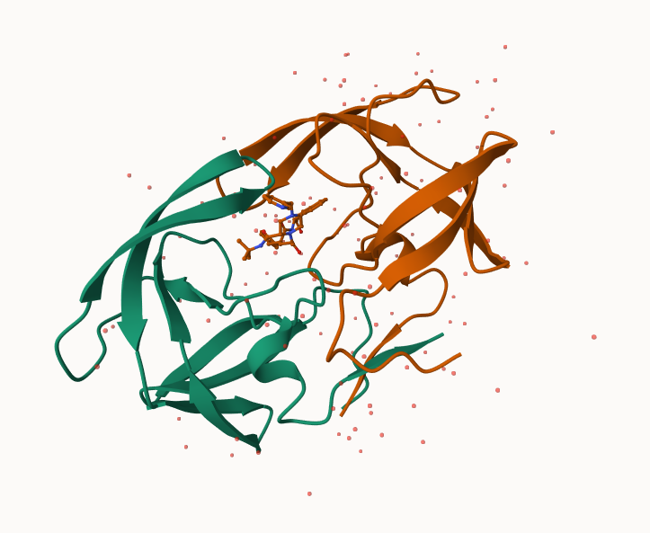
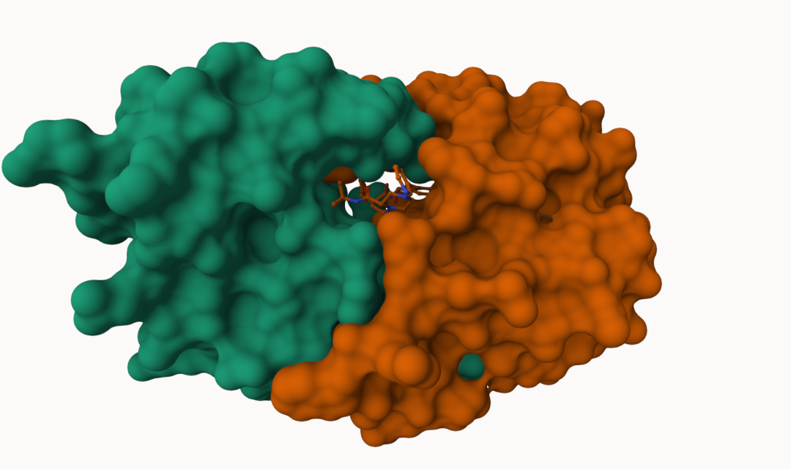
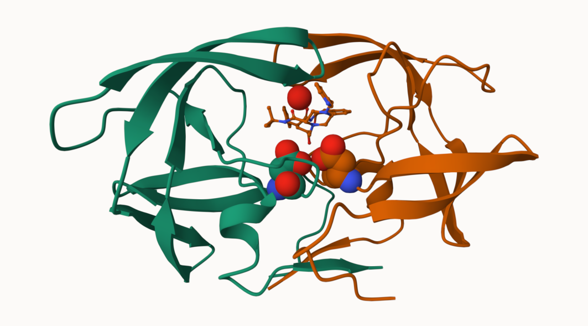

# Class 10: PDB and Structural Bioinformatics
Olivia Baldwin

``` r
pdb_data <- read.csv("data_export_summary.csv", row.names = 1)
head(pdb_data)
```

                              X.ray     EM    NMR Multiple.methods Neutron Other
    Protein (only)          167,317 15,698 12,534              208      77    32
    Protein/Oligosaccharide   9,645  2,639     34                8       2     0
    Protein/NA                8,735  4,718    286                7       0     0
    Nucleic acid (only)       2,869    138  1,507               14       3     1
    Other                       170     10     33                0       0     0
    Oligosaccharide (only)       11      0      6                1       0     4
                              Total
    Protein (only)          195,866
    Protein/Oligosaccharide  12,328
    Protein/NA               13,746
    Nucleic acid (only)       4,532
    Other                       213
    Oligosaccharide (only)       22

``` r
#create a function
comma_number <- function(x){
  x <- gsub(",", "", x)
  x <- as.numeric(x)
  
  return(x)
}
```

``` r
x.ray_num <- comma_number(pdb_data$X.ray)
x.ray_tot <- sum(x.ray_num)

total_sum <- sum(comma_number(pdb_data$Total))
```

The `apply()` function can take any function and apply it over rows or
cols.

``` r
colSums(apply(pdb_data, 2, comma_number)) / total_sum
```

               X.ray               EM              NMR Multiple.methods 
        0.8325592064     0.1023479646     0.0635181093     0.0010498132 
             Neutron            Other            Total 
        0.0003617003     0.0001632063     1.0000000000 

``` r
#can also use this package that will read it in as a numeric and take out commas for you

library(readr)
pdb_csv <- read_csv("data_export_summary.csv")
```

    Rows: 6 Columns: 8
    ── Column specification ────────────────────────────────────────────────────────
    Delimiter: ","
    chr (1): Molecular Type
    dbl (3): Multiple methods, Neutron, Other
    num (4): X-ray, EM, NMR, Total

    ℹ Use `spec()` to retrieve the full column specification for this data.
    ℹ Specify the column types or set `show_col_types = FALSE` to quiet this message.

> Q1: X ray solves 83.25% and EM solves 10.23% for a total of 93.48%.

``` r
sum(comma_number(pdb_data[1:3,7])) / total_sum
```

    [1] 0.9789729

> Q2: 97.9% are protein.

\##Using Mol\*







> Q4: The hydrogens do not show up because they are too small.

> Q5: Water molecule (HOH) 308

## Bio3D package for Structural Bioinformatics

``` r
library(bio3d)
```

``` r
pdb <- read.pdb("1HSG")
```

      Note: Accessing on-line PDB file

``` r
summary(pdb)
```


     Call:  read.pdb(file = "1HSG")

       Total Models#: 1
         Total Atoms#: 1686,  XYZs#: 5058  Chains#: 2  (values: A B)

         Protein Atoms#: 1514  (residues/Calpha atoms#: 198)
         Nucleic acid Atoms#: 0  (residues/phosphate atoms#: 0)

         Non-protein/nucleic Atoms#: 172  (residues: 128)
         Non-protein/nucleic resid values: [ HOH (127), MK1 (1) ]

    + attr: atom, xyz, seqres, helix, sheet,
            calpha, remark, call

``` r
attributes(pdb)
```

    $names
    [1] "atom"   "xyz"    "seqres" "helix"  "sheet"  "calpha" "remark" "call"  

    $class
    [1] "pdb" "sse"

``` r
head(pdb$atom) 
```

      type eleno elety  alt resid chain resno insert      x      y     z o     b
    1 ATOM     1     N <NA>   PRO     A     1   <NA> 29.361 39.686 5.862 1 38.10
    2 ATOM     2    CA <NA>   PRO     A     1   <NA> 30.307 38.663 5.319 1 40.62
    3 ATOM     3     C <NA>   PRO     A     1   <NA> 29.760 38.071 4.022 1 42.64
    4 ATOM     4     O <NA>   PRO     A     1   <NA> 28.600 38.302 3.676 1 43.40
    5 ATOM     5    CB <NA>   PRO     A     1   <NA> 30.508 37.541 6.342 1 37.87
    6 ATOM     6    CG <NA>   PRO     A     1   <NA> 29.296 37.591 7.162 1 38.40
      segid elesy charge
    1  <NA>     N   <NA>
    2  <NA>     C   <NA>
    3  <NA>     C   <NA>
    4  <NA>     O   <NA>
    5  <NA>     C   <NA>
    6  <NA>     C   <NA>

``` r
pdbseq(pdb)[25]
```

     25 
    "D" 

> Q7: There are 198 amino acid residues

> Q8: The non-protein residues are the waters and the MK1 (drug)

> Q9: 2 protein chains

## Functional dynamics prediction

``` r
#library(r3dmol)
#source("https://tinyurl.com/viewpdb")
```

``` r
#view.pdb(pdb, backgroundColor = "lightpink")
```

``` r
#view.pdb(adk, backgroundColor = "lightgrey")
```

``` r
adk <- read.pdb("6s36")
```

      Note: Accessing on-line PDB file
       PDB has ALT records, taking A only, rm.alt=TRUE

``` r
adk
```


     Call:  read.pdb(file = "6s36")

       Total Models#: 1
         Total Atoms#: 1898,  XYZs#: 5694  Chains#: 1  (values: A)

         Protein Atoms#: 1654  (residues/Calpha atoms#: 214)
         Nucleic acid Atoms#: 0  (residues/phosphate atoms#: 0)

         Non-protein/nucleic Atoms#: 244  (residues: 244)
         Non-protein/nucleic resid values: [ CL (3), HOH (238), MG (2), NA (1) ]

       Protein sequence:
          MRIILLGAPGAGKGTQAQFIMEKYGIPQISTGDMLRAAVKSGSELGKQAKDIMDAGKLVT
          DELVIALVKERIAQEDCRNGFLLDGFPRTIPQADAMKEAGINVDYVLEFDVPDELIVDKI
          VGRRVHAPSGRVYHVKFNPPKVEGKDDVTGEELTTRKDDQEETVRKRLVEYHQMTAPLIG
          YYSKEAEAGNTKYAKVDGTKPVAEVRADLEKILG

    + attr: atom, xyz, seqres, helix, sheet,
            calpha, remark, call

``` r
#flexibility prediction
flex_pred <- nma(adk) 
```

     Building Hessian...        Done in 0.01 seconds.
     Diagonalizing Hessian...   Done in 0.2 seconds.

``` r
plot(flex_pred)
```


``` r
mktrj(flex_pred, pdb=adk, file= "adk-m7.pdb")

#view the file this outputs in Mol-star by opening the file created by `mktrj()`
#if you don't add the "pdb" argument, the sequence will not show up in Mol-star correctly 
```
