# Class 11: Structural Bioinformatics Part 2
Olivia Baldwin

Today, before delving into structure prediction with AlphaFold we will
finish off our previous Lab 10 comparative structure analysis section.

``` r
library(bio3d)
```

``` r
id <- "1ake_A" 
aa <- get.seq(id)
```

    Warning in get.seq(id): Removing existing file: seqs.fasta

    Fetching... Please wait. Done.

``` r
print(aa)
```

                 1        .         .         .         .         .         60 
    pdb|1AKE|A   MRIILLGAPGAGKGTQAQFIMEKYGIPQISTGDMLRAAVKSGSELGKQAKDIMDAGKLVT
                 1        .         .         .         .         .         60 

                61        .         .         .         .         .         120 
    pdb|1AKE|A   DELVIALVKERIAQEDCRNGFLLDGFPRTIPQADAMKEAGINVDYVLEFDVPDELIVDRI
                61        .         .         .         .         .         120 

               121        .         .         .         .         .         180 
    pdb|1AKE|A   VGRRVHAPSGRVYHVKFNPPKVEGKDDVTGEELTTRKDDQEETVRKRLVEYHQMTAPLIG
               121        .         .         .         .         .         180 

               181        .         .         .   214 
    pdb|1AKE|A   YYSKEAEAGNTKYAKVDGTKPVAEVRADLEKILG
               181        .         .         .   214 

    Call:
      read.fasta(file = outfile)

    Class:
      fasta

    Alignment dimensions:
      1 sequence rows; 214 position columns (214 non-gap, 0 gap) 

    + attr: id, ali, call

``` r
b <- blast.pdb(aa) 
```

     Searching ... please wait (updates every 5 seconds) RID = N6Y5749E016 
     ...
     Reporting 86 hits

``` r
attributes(b)
```

    $names
    [1] "hit.tbl" "raw"     "url"    

    $class
    [1] "blast"

``` r
head(b$hit.tbl) 
```

           queryid subjectids identity alignmentlength mismatches gapopens q.start
    1 Query_269693     1AKE_A  100.000             214          0        0       1
    2 Query_269693     8BQF_A   99.533             214          1        0       1
    3 Query_269693     4X8M_A   99.533             214          1        0       1
    4 Query_269693     6S36_A   99.533             214          1        0       1
    5 Query_269693     8Q2B_A   99.533             214          1        0       1
    6 Query_269693     8RJ9_A   99.533             214          1        0       1
      q.end s.start s.end    evalue bitscore positives mlog.evalue pdb.id    acc
    1   214       1   214 1.58e-156      432    100.00    358.7458 1AKE_A 1AKE_A
    2   214      21   234 2.59e-156      433    100.00    358.2516 8BQF_A 8BQF_A
    3   214       1   214 2.83e-156      432    100.00    358.1630 4X8M_A 4X8M_A
    4   214       1   214 4.16e-156      432    100.00    357.7778 6S36_A 6S36_A
    5   214       1   214 1.10e-155      431     99.53    356.8054 8Q2B_A 8Q2B_A
    6   214       1   214 1.10e-155      431     99.53    356.8054 8RJ9_A 8RJ9_A

``` r
hits <- plot(b)
```

      * Possible cutoff values:    197 11 
                Yielding Nhits:    19 86 

      * Chosen cutoff value of:    197 
                Yielding Nhits:    19 

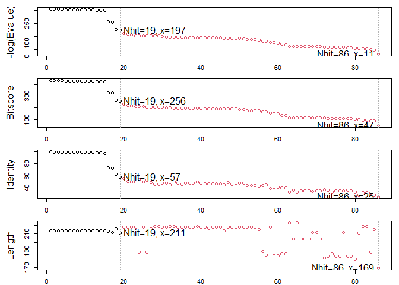

``` r
attributes(hits)
```

    $names
    [1] "hits"   "pdb.id" "acc"    "inds"  

    $class
    [1] "blast"

Top hits that we like from our blast results:

``` r
hits$pdb.id
```

     [1] "1AKE_A" "8BQF_A" "4X8M_A" "6S36_A" "8Q2B_A" "8RJ9_A" "6RZE_A" "4X8H_A"
     [9] "3HPR_A" "1E4V_A" "5EJE_A" "1E4Y_A" "3X2S_A" "6HAP_A" "6HAM_A" "4K46_A"
    [17] "4NP6_A" "3GMT_A" "4PZL_A"

``` r
#downloads the pdb files from our top hits in the blast result

files <- get.pdb(hits$pdb.id, path="pdbs", plot=TRUE, gzip=TRUE) 
```

    Warning in get.pdb(hits$pdb.id, path = "pdbs", plot = TRUE, gzip = TRUE):
    pdbs/1AKE.pdb exists. Skipping download

    Warning in get.pdb(hits$pdb.id, path = "pdbs", plot = TRUE, gzip = TRUE):
    pdbs/8BQF.pdb exists. Skipping download

    Warning in get.pdb(hits$pdb.id, path = "pdbs", plot = TRUE, gzip = TRUE):
    pdbs/4X8M.pdb exists. Skipping download

    Warning in get.pdb(hits$pdb.id, path = "pdbs", plot = TRUE, gzip = TRUE):
    pdbs/6S36.pdb exists. Skipping download

    Warning in get.pdb(hits$pdb.id, path = "pdbs", plot = TRUE, gzip = TRUE):
    pdbs/8Q2B.pdb exists. Skipping download

    Warning in get.pdb(hits$pdb.id, path = "pdbs", plot = TRUE, gzip = TRUE):
    pdbs/8RJ9.pdb exists. Skipping download

    Warning in get.pdb(hits$pdb.id, path = "pdbs", plot = TRUE, gzip = TRUE):
    pdbs/6RZE.pdb exists. Skipping download

    Warning in get.pdb(hits$pdb.id, path = "pdbs", plot = TRUE, gzip = TRUE):
    pdbs/4X8H.pdb exists. Skipping download

    Warning in get.pdb(hits$pdb.id, path = "pdbs", plot = TRUE, gzip = TRUE):
    pdbs/3HPR.pdb exists. Skipping download

    Warning in get.pdb(hits$pdb.id, path = "pdbs", plot = TRUE, gzip = TRUE):
    pdbs/1E4V.pdb exists. Skipping download

    Warning in get.pdb(hits$pdb.id, path = "pdbs", plot = TRUE, gzip = TRUE):
    pdbs/5EJE.pdb exists. Skipping download

    Warning in get.pdb(hits$pdb.id, path = "pdbs", plot = TRUE, gzip = TRUE):
    pdbs/1E4Y.pdb exists. Skipping download

    Warning in get.pdb(hits$pdb.id, path = "pdbs", plot = TRUE, gzip = TRUE):
    pdbs/3X2S.pdb exists. Skipping download

    Warning in get.pdb(hits$pdb.id, path = "pdbs", plot = TRUE, gzip = TRUE):
    pdbs/6HAP.pdb exists. Skipping download

    Warning in get.pdb(hits$pdb.id, path = "pdbs", plot = TRUE, gzip = TRUE):
    pdbs/6HAM.pdb exists. Skipping download

    Warning in get.pdb(hits$pdb.id, path = "pdbs", plot = TRUE, gzip = TRUE):
    pdbs/4K46.pdb exists. Skipping download

    Warning in get.pdb(hits$pdb.id, path = "pdbs", plot = TRUE, gzip = TRUE):
    pdbs/4NP6.pdb exists. Skipping download

    Warning in get.pdb(hits$pdb.id, path = "pdbs", plot = TRUE, gzip = TRUE):
    pdbs/3GMT.pdb exists. Skipping download

    Warning in get.pdb(hits$pdb.id, path = "pdbs", plot = TRUE, gzip = TRUE):
    pdbs/4PZL.pdb exists. Skipping download

I have now downloaded all ADK structures in the PDB database but viewing
them is difficult as they need to be aligned and superposed.

I am going to install BiocManager package from CRAN. Then I can use
`BiocManager::install()` to install any bioconductor package.

``` r
#align pdbs so they are superposed (all turned/put in the same view angle)
pdbs <- pdbaln(files, fit = TRUE, exefile="msa")
```

    Reading PDB files:
    pdbs/1AKE.pdb
    pdbs/8BQF.pdb
    pdbs/4X8M.pdb
    pdbs/6S36.pdb
    pdbs/8Q2B.pdb
    pdbs/8RJ9.pdb
    pdbs/6RZE.pdb
    pdbs/4X8H.pdb
    pdbs/3HPR.pdb
    pdbs/1E4V.pdb
    pdbs/5EJE.pdb
    pdbs/1E4Y.pdb
    pdbs/3X2S.pdb
    pdbs/6HAP.pdb
    pdbs/6HAM.pdb
    pdbs/4K46.pdb
    pdbs/4NP6.pdb
    pdbs/3GMT.pdb
    pdbs/4PZL.pdb
       PDB has ALT records, taking A only, rm.alt=TRUE
    .   PDB has ALT records, taking A only, rm.alt=TRUE
    ..   PDB has ALT records, taking A only, rm.alt=TRUE
    .   PDB has ALT records, taking A only, rm.alt=TRUE
    .   PDB has ALT records, taking A only, rm.alt=TRUE
    .   PDB has ALT records, taking A only, rm.alt=TRUE
    ..   PDB has ALT records, taking A only, rm.alt=TRUE
    ..   PDB has ALT records, taking A only, rm.alt=TRUE
    ....   PDB has ALT records, taking A only, rm.alt=TRUE
    .   PDB has ALT records, taking A only, rm.alt=TRUE
    .   PDB has ALT records, taking A only, rm.alt=TRUE
    ..   PDB has ALT records, taking A only, rm.alt=TRUE
    .

    Extracting sequences

    pdb/seq: 1   name: pdbs/1AKE.pdb 
       PDB has ALT records, taking A only, rm.alt=TRUE
    pdb/seq: 2   name: pdbs/8BQF.pdb 
       PDB has ALT records, taking A only, rm.alt=TRUE
    pdb/seq: 3   name: pdbs/4X8M.pdb 
    pdb/seq: 4   name: pdbs/6S36.pdb 
       PDB has ALT records, taking A only, rm.alt=TRUE
    pdb/seq: 5   name: pdbs/8Q2B.pdb 
       PDB has ALT records, taking A only, rm.alt=TRUE
    pdb/seq: 6   name: pdbs/8RJ9.pdb 
       PDB has ALT records, taking A only, rm.alt=TRUE
    pdb/seq: 7   name: pdbs/6RZE.pdb 
       PDB has ALT records, taking A only, rm.alt=TRUE
    pdb/seq: 8   name: pdbs/4X8H.pdb 
    pdb/seq: 9   name: pdbs/3HPR.pdb 
       PDB has ALT records, taking A only, rm.alt=TRUE
    pdb/seq: 10   name: pdbs/1E4V.pdb 
    pdb/seq: 11   name: pdbs/5EJE.pdb 
       PDB has ALT records, taking A only, rm.alt=TRUE
    pdb/seq: 12   name: pdbs/1E4Y.pdb 
    pdb/seq: 13   name: pdbs/3X2S.pdb 
    pdb/seq: 14   name: pdbs/6HAP.pdb 
    pdb/seq: 15   name: pdbs/6HAM.pdb 
       PDB has ALT records, taking A only, rm.alt=TRUE
    pdb/seq: 16   name: pdbs/4K46.pdb 
       PDB has ALT records, taking A only, rm.alt=TRUE
    pdb/seq: 17   name: pdbs/4NP6.pdb 
       PDB has ALT records, taking A only, rm.alt=TRUE
    pdb/seq: 18   name: pdbs/3GMT.pdb 
    pdb/seq: 19   name: pdbs/4PZL.pdb 
       PDB has ALT records, taking A only, rm.alt=TRUE

``` r
pdbs
```

                    1        .         .         .         .         .         60 
    pdbs/1AKE.pdb   ------------------------------------------------------------
    pdbs/8BQF.pdb   MRIILLGAPGAGKGTQAQFIMEKYGIPQISTGDMLRAAVKSGSELGKQAKDIMDAGKLVT
    pdbs/4X8M.pdb   ------------------------------------------------------------
    pdbs/6S36.pdb   ------------------------------------------------------------
    pdbs/8Q2B.pdb   ------------------------------------------------------------
    pdbs/8RJ9.pdb   ------------------------------------------------------------
    pdbs/6RZE.pdb   ------------------------------------------------------------
    pdbs/4X8H.pdb   ------------------------------------------------------------
    pdbs/3HPR.pdb   ------------------------------------------------------------
    pdbs/1E4V.pdb   ------------------------------------------------------------
    pdbs/5EJE.pdb   ------------------------------------------------------------
    pdbs/1E4Y.pdb   ------------------------------------------------------------
    pdbs/3X2S.pdb   ------------------------------------------------------------
    pdbs/6HAP.pdb   ------------------------------------------------------------
    pdbs/6HAM.pdb   ------------------------------------------------------------
    pdbs/4K46.pdb   ------------------------------------------------------------
    pdbs/4NP6.pdb   ------------------------------------------------------------
    pdbs/3GMT.pdb   ------------------------------------------------------------
    pdbs/4PZL.pdb   ------------------------------------------------------------
                                                                                 
                    1        .         .         .         .         .         60 

                   61        .         .         .         .         .         120 
    pdbs/1AKE.pdb   ------------------------------------------------------------
    pdbs/8BQF.pdb   DELVIALVKERIAQEGFLLDGFPRTIPQADAMKEAGINVDYVIEFDVPDELIVDRIVGRR
    pdbs/4X8M.pdb   ------------------------------------------------------------
    pdbs/6S36.pdb   ------------------------------------------------------------
    pdbs/8Q2B.pdb   ------------------------------------------------------------
    pdbs/8RJ9.pdb   ------------------------------------------------------------
    pdbs/6RZE.pdb   ------------------------------------------------------------
    pdbs/4X8H.pdb   ------------------------------------------------------------
    pdbs/3HPR.pdb   ------------------------------------------------------------
    pdbs/1E4V.pdb   ------------------------------------------------------------
    pdbs/5EJE.pdb   ------------------------------------------------------------
    pdbs/1E4Y.pdb   ------------------------------------------------------------
    pdbs/3X2S.pdb   ------------------------------------------------------------
    pdbs/6HAP.pdb   ------------------------------------------------------------
    pdbs/6HAM.pdb   ------------------------------------------------------------
    pdbs/4K46.pdb   ------------------------------------------------------------
    pdbs/4NP6.pdb   ------------------------------------------------------------
    pdbs/3GMT.pdb   ------------------------------------------------------------
    pdbs/4PZL.pdb   ------------------------------------------------------------
                                                                                 
                   61        .         .         .         .         .         120 

                  121        .         .         .         .         .         180 
    pdbs/1AKE.pdb   ------------------------------------------------------------
    pdbs/8BQF.pdb   VHAPSGRVYHVKFNPPKVEGKDDVTGEELTTRKDDQEETVRKRLVEYHQMTAPLIGYYSK
    pdbs/4X8M.pdb   ------------------------------------------------------------
    pdbs/6S36.pdb   ------------------------------------------------------------
    pdbs/8Q2B.pdb   ------------------------------------------------------------
    pdbs/8RJ9.pdb   ------------------------------------------------------------
    pdbs/6RZE.pdb   ------------------------------------------------------------
    pdbs/4X8H.pdb   ------------------------------------------------------------
    pdbs/3HPR.pdb   ------------------------------------------------------------
    pdbs/1E4V.pdb   ------------------------------------------------------------
    pdbs/5EJE.pdb   ------------------------------------------------------------
    pdbs/1E4Y.pdb   ------------------------------------------------------------
    pdbs/3X2S.pdb   ------------------------------------------------------------
    pdbs/6HAP.pdb   ------------------------------------------------------------
    pdbs/6HAM.pdb   ------------------------------------------------------------
    pdbs/4K46.pdb   ------------------------------------------------------------
    pdbs/4NP6.pdb   ------------------------------------------------------------
    pdbs/3GMT.pdb   ------------------------------------------------------------
    pdbs/4PZL.pdb   ------------------------------------------------------------
                                                                                 
                  121        .         .         .         .         .         180 

                  181        .         .         .         .         .         240 
    pdbs/1AKE.pdb   ------------------------------------------------------------
    pdbs/8BQF.pdb   EAEAGNTKYAKVDGTKPVAEVRADLEKILMRIILLGAPGAGKGTQAQFIMEKYGIPQIST
    pdbs/4X8M.pdb   ------------------------------------------------------------
    pdbs/6S36.pdb   ------------------------------------------------------------
    pdbs/8Q2B.pdb   ------------------------------------------------------------
    pdbs/8RJ9.pdb   ------------------------------------------------------------
    pdbs/6RZE.pdb   ------------------------------------------------------------
    pdbs/4X8H.pdb   ------------------------------------------------------------
    pdbs/3HPR.pdb   ------------------------------------------------------------
    pdbs/1E4V.pdb   ------------------------------------------------------------
    pdbs/5EJE.pdb   ------------------------------------------------------------
    pdbs/1E4Y.pdb   ------------------------------------------------------------
    pdbs/3X2S.pdb   ------------------------------------------------------------
    pdbs/6HAP.pdb   ------------------------------------------------------------
    pdbs/6HAM.pdb   ------------------------------------------------------------
    pdbs/4K46.pdb   ------------------------------------------------------------
    pdbs/4NP6.pdb   ---------------------------NAMRIILLGAPGAGKGTQAQFIMEKFGIPQIST
    pdbs/3GMT.pdb   ------------------------------------------------------------
    pdbs/4PZL.pdb   -------------------TENLYFQSNAMRIILLGAPGAGKGTQAKIIEQKYNIAHIST
                                                                                 
                  181        .         .         .         .         .         240 

                  241        .         .         .         .         .         300 
    pdbs/1AKE.pdb   ------------------------------------------------------------
    pdbs/8BQF.pdb   GDMLRAAVKSGSELGKQAKDIMDAGKLVTDELVIALVKERIAQEDCRNGFLLDGFPRTIP
    pdbs/4X8M.pdb   ------------------------------------------------------------
    pdbs/6S36.pdb   ------------------------------------------------------------
    pdbs/8Q2B.pdb   ------------------------------------------------------------
    pdbs/8RJ9.pdb   ------------------------------------------------------------
    pdbs/6RZE.pdb   ------------------------------------------------------------
    pdbs/4X8H.pdb   ------------------------------------------------------------
    pdbs/3HPR.pdb   ------------------------------------------------------------
    pdbs/1E4V.pdb   ------------------------------------------------------------
    pdbs/5EJE.pdb   ------------------------------------------------------------
    pdbs/1E4Y.pdb   ------------------------------------------------------------
    pdbs/3X2S.pdb   ------------------------------------------------------------
    pdbs/6HAP.pdb   ------------------------------------------------------------
    pdbs/6HAM.pdb   ------------------------------------------------------------
    pdbs/4K46.pdb   ------------------------------------------------------------
    pdbs/4NP6.pdb   GDMLRAAIKAGTELGKQAKAVIDAGQLVSDDIILGLIKERIAQADCEKGFLLDGFPRTIP
    pdbs/3GMT.pdb   ------------------------------------------------------------
    pdbs/4PZL.pdb   GDMIRETIKSGSALGQELKKVLDAGELVSDEFIIKIVKDRISKNDCNNGFLLDGVPRTIP
                                                                                 
                  241        .         .         .         .         .         300 

                  301        .         .         .         .         .         360 
    pdbs/1AKE.pdb   ------------------------------------------------------------
    pdbs/8BQF.pdb   QADAMKEAGINVDYVIEFDVPDELIVDRIVGRRVHAPSGRVYHVKFNPPKVEGKDDVTGE
    pdbs/4X8M.pdb   ------------------------------------------------------------
    pdbs/6S36.pdb   ------------------------------------------------------------
    pdbs/8Q2B.pdb   ------------------------------------------------------------
    pdbs/8RJ9.pdb   ------------------------------------------------------------
    pdbs/6RZE.pdb   ------------------------------------------------------------
    pdbs/4X8H.pdb   ------------------------------------------------------------
    pdbs/3HPR.pdb   ------------------------------------------------------------
    pdbs/1E4V.pdb   ------------------------------------------------------------
    pdbs/5EJE.pdb   ------------------------------------------------------------
    pdbs/1E4Y.pdb   ------------------------------------------------------------
    pdbs/3X2S.pdb   ------------------------------------------------------------
    pdbs/6HAP.pdb   ------------------------------------------------------------
    pdbs/6HAM.pdb   ------------------------------------------------------------
    pdbs/4K46.pdb   ------------------------------------------------------------
    pdbs/4NP6.pdb   QADGLKEMGINVDYVIEFDVADDVIVERMAGRRAHLPSGRTYHVVYNPPKVEGKDDVTGE
    pdbs/3GMT.pdb   ------------------------------------------------------------
    pdbs/4PZL.pdb   QAQELDKLGVNIDYIVEVDVADNLLIERITGRRIHPASGRTYHTKFNPPKVADKDDVTGE
                                                                                 
                  301        .         .         .         .         .         360 

                  361        .         .         .         .         .         420 
    pdbs/1AKE.pdb   ------------------------------------------------------------
    pdbs/8BQF.pdb   ELTTRKDDQEETVRKRLVEYHQMTAPLIGYYSKEAEAGNT--KYAKVDGTKPVAEVRADL
    pdbs/4X8M.pdb   ------------------------------------------------------------
    pdbs/6S36.pdb   ------------------------------------------------------------
    pdbs/8Q2B.pdb   ------------------------------------------------------------
    pdbs/8RJ9.pdb   ------------------------------------------------------------
    pdbs/6RZE.pdb   ------------------------------------------------------------
    pdbs/4X8H.pdb   ------------------------------------------------------------
    pdbs/3HPR.pdb   ------------------------------------------------------------
    pdbs/1E4V.pdb   ------------------------------------------------------------
    pdbs/5EJE.pdb   ------------------------------------------------------------
    pdbs/1E4Y.pdb   ------------------------------------------------------------
    pdbs/3X2S.pdb   ------------------------------------------------------------
    pdbs/6HAP.pdb   ------------------------------------------------------------
    pdbs/6HAM.pdb   ------------------------------------------------------------
    pdbs/4K46.pdb   ------------------------------------------------------------
    pdbs/4NP6.pdb   DLVIREDDKEETVRARLNVYHTQTAPLIEYYGKEAAAGKT--QYLKFDGTKQVSEVSADI
    pdbs/3GMT.pdb   ------------------------------------------------------------
    pdbs/4PZL.pdb   PLITRTDDNEDTVKQRLSVYHAQTAKLIDFYRNFSSTNTKIPKYIKINGDQAVEKVSQDI
                                                                                 
                  361        .         .         .         .         .         420 

                  421        .         .         .         .         .         480 
    pdbs/1AKE.pdb   ------------------------------------------------------------
    pdbs/8BQF.pdb   EKILGMRIILLGAPGAGKGTQAQFIMEKYGIPQISTGDMLRAAVKSGSELGKQAKDIMDA
    pdbs/4X8M.pdb   ------------------------------------------------------------
    pdbs/6S36.pdb   ------------------------------------------------------------
    pdbs/8Q2B.pdb   ------------------------------------------------------------
    pdbs/8RJ9.pdb   ------------------------------------------------------------
    pdbs/6RZE.pdb   ------------------------------------------------------------
    pdbs/4X8H.pdb   ------------------------------------------------------------
    pdbs/3HPR.pdb   ------------------------------------------------------------
    pdbs/1E4V.pdb   ------------------------------------------------------------
    pdbs/5EJE.pdb   ------------------------------------------------------------
    pdbs/1E4Y.pdb   ------------------------------------------------------------
    pdbs/3X2S.pdb   ------------------------------------------------------------
    pdbs/6HAP.pdb   ------------------------------------------------------------
    pdbs/6HAM.pdb   ------------------------------------------------------------
    pdbs/4K46.pdb   ------------------------------------------------------------
    pdbs/4NP6.pdb   AKALAA------------------------------------------------------
    pdbs/3GMT.pdb   ------------------------------------------------------------
    pdbs/4PZL.pdb   FDQLNKTENLYFQSNA--------------------------------------------
                                                                                 
                  421        .         .         .         .         .         480 

                  481        .         .         .         .         .         540 
    pdbs/1AKE.pdb   ------------------------------------------------------------
    pdbs/8BQF.pdb   GKLVTDELVIALVKERIAQGFLLDGFPRTIPQADAMKEAGINVDYVIEFDVPDELIVDRI
    pdbs/4X8M.pdb   ------------------------------------------------------------
    pdbs/6S36.pdb   ------------------------------------------------------------
    pdbs/8Q2B.pdb   ------------------------------------------------------------
    pdbs/8RJ9.pdb   ------------------------------------------------------------
    pdbs/6RZE.pdb   ------------------------------------------------------------
    pdbs/4X8H.pdb   ------------------------------------------------------------
    pdbs/3HPR.pdb   ------------------------------------------------------------
    pdbs/1E4V.pdb   ------------------------------------------------------------
    pdbs/5EJE.pdb   ------------------------------------------------------------
    pdbs/1E4Y.pdb   ------------------------------------------------------------
    pdbs/3X2S.pdb   ------------------------------------------------------------
    pdbs/6HAP.pdb   ------------------------------------------------------------
    pdbs/6HAM.pdb   ------------------------------------------------------------
    pdbs/4K46.pdb   ------------------------------------------------------------
    pdbs/4NP6.pdb   ------------------------------------------------------------
    pdbs/3GMT.pdb   ------------------------------------------------------------
    pdbs/4PZL.pdb   ------------------------------------------------------------
                                                                                 
                  481        .         .         .         .         .         540 

                  541        .         .         .         .         .         600 
    pdbs/1AKE.pdb   ------------------------------------------------------------
    pdbs/8BQF.pdb   VGRRVHAPSGRVYHVKFNPPKVEGKDDVTGEELTTRKDDQEETVRKRLVEYHQMTAPLIG
    pdbs/4X8M.pdb   ------------------------------------------------------------
    pdbs/6S36.pdb   ------------------------------------------------------------
    pdbs/8Q2B.pdb   ------------------------------------------------------------
    pdbs/8RJ9.pdb   ------------------------------------------------------------
    pdbs/6RZE.pdb   ------------------------------------------------------------
    pdbs/4X8H.pdb   ------------------------------------------------------------
    pdbs/3HPR.pdb   ------------------------------------------------------------
    pdbs/1E4V.pdb   ------------------------------------------------------------
    pdbs/5EJE.pdb   ------------------------------------------------------------
    pdbs/1E4Y.pdb   ------------------------------------------------------------
    pdbs/3X2S.pdb   ------------------------------------------------------------
    pdbs/6HAP.pdb   ------------------------------------------------------------
    pdbs/6HAM.pdb   ------------------------------------------------------------
    pdbs/4K46.pdb   ------------------------------------------------------------
    pdbs/4NP6.pdb   ------------------------------------------------------------
    pdbs/3GMT.pdb   ------------------------------------------------------------
    pdbs/4PZL.pdb   ------------------------------------------------------------
                                                                                 
                  541        .         .         .         .         .         600 

                  601        .         .         .         .         .         660 
    pdbs/1AKE.pdb   -----------------------------------MRIILLGAPGAGKGTQAQFIMEKYG
    pdbs/8BQF.pdb   YYSKEAEAGNTKYAKVDGTKPVAEVRADLEKILGHMRIILLGAPGAGKGTQAQFIMEKYG
    pdbs/4X8M.pdb   ------------------------------------------------------------
    pdbs/6S36.pdb   ------------------------------------------------------------
    pdbs/8Q2B.pdb   -----------------------------------MRIILLGAPGAGKGTQAQFIMEKYG
    pdbs/8RJ9.pdb   -----------------------------------MRIILLGAPGAGKGTQAQFIMEKYG
    pdbs/6RZE.pdb   ------------------------------------------------------------
    pdbs/4X8H.pdb   ------------------------------------------------------------
    pdbs/3HPR.pdb   -----------------------------------MRIILLGAPGAGKGTQAQFIMEKYG
    pdbs/1E4V.pdb   -----------------------------------MRIILLGAPVAGKGTQAQFIMEKYG
    pdbs/5EJE.pdb   -----------------------------------MRIILLGAPGAGKGTQAQFIMEKYG
    pdbs/1E4Y.pdb   -----------------------------------MRIILLGALVAGKGTQAQFIMEKYG
    pdbs/3X2S.pdb   -----------------------------------MRIILLGAPGAGKGTQAQFIMEKYG
    pdbs/6HAP.pdb   ------------------------------------------------------------
    pdbs/6HAM.pdb   ------------------------------------------------------------
    pdbs/4K46.pdb   ------------------------------------------------------------
    pdbs/4NP6.pdb   -----------------------------------MRIILLGAPGAGKGTQAQFIMEKFG
    pdbs/3GMT.pdb   -----------------------------------MRLILLGAPGAGKGTQANFIKEKFG
    pdbs/4PZL.pdb   -----------------------------------MRIILLGAPGAGKGTQAKIIEQKYN
                                                                                 
                  601        .         .         .         .         .         660 

                  661        .         .         .         .         .         720 
    pdbs/1AKE.pdb   IPQISTGDMLRAAVKSGSELGKQAKDIMDAGKLVTDELVIALVKERIAQEDCRNGFLLDG
    pdbs/8BQF.pdb   IPQISTGDMLRAAVKSGSELGKQAKDIMDAGKLVTDELVIALVKERIAQEDCRNGFLLDG
    pdbs/4X8M.pdb   ------------------------------------------------------------
    pdbs/6S36.pdb   ------------------------------------------------------------
    pdbs/8Q2B.pdb   IPQISTGDMLRAAVKSGSELGKQAKDIMDAGKLVTDELVIALVKERIAQEDCRNGFLLDG
    pdbs/8RJ9.pdb   IPQISTGDMLRAAVKSGSELGKQAKDIMDAGKLVTDELVIALVKERIAQEDCRNGFLLAG
    pdbs/6RZE.pdb   ------------------------------------------------------------
    pdbs/4X8H.pdb   ------------------------------------------------------------
    pdbs/3HPR.pdb   IPQISTGDMLRAAVKSGSELGKQAKDIMDAGKLVTDELVIALVKERIAQEDCRNGFLLDG
    pdbs/1E4V.pdb   IPQISTGDMLRAAVKSGSELGKQAKDIMDAGKLVTDELVIALVKERIAQEDCRNGFLLDG
    pdbs/5EJE.pdb   IPQISTGDMLRAAVKSGSELGKQAKDIMDACKLVTDELVIALVKERIAQEDCRNGFLLDG
    pdbs/1E4Y.pdb   IPQISTGDMLRAAVKSGSELGKQAKDIMDAGKLVTDELVIALVKERIAQEDCRNGFLLDG
    pdbs/3X2S.pdb   IPQISTGDMLRAAVKSGSELGKQAKDIMDCGKLVTDELVIALVKERIAQEDSRNGFLLDG
    pdbs/6HAP.pdb   ------------------------------------------------------------
    pdbs/6HAM.pdb   ------------------------------------------------------------
    pdbs/4K46.pdb   ------------------------------------------------------------
    pdbs/4NP6.pdb   IPQISTGDMLRAAIKAGTELGKQAKAVIDAGQLVSDDIILGLIKERIAQADCEKGFLLDG
    pdbs/3GMT.pdb   IPQISTGDMLRAAVKAGTPLGVEAKTYMDEGKLVPDSLIIGLVKERLKEADCANGYLFDG
    pdbs/4PZL.pdb   IAHISTGDMIRETIKSGSALGQELKKVLDAGELVSDEFIIKIVKDRISKNDCNNGFLLDG
                                                                                 
                  661        .         .         .         .         .         720 

                  721        .         .         .         .         .         780 
    pdbs/1AKE.pdb   FPRTIPQADAMKEAGINVDYVLEFDVPDELIVDRIVGRRVHAPSGRVYHVKFNPPKVEGK
    pdbs/8BQF.pdb   FPRTIPQADAMKEAGINVDYVIEFDVPDELIVDRIVGRRVHAPSGRVYHVKFNPPKVEGK
    pdbs/4X8M.pdb   ------------------------------------------------------------
    pdbs/6S36.pdb   ------------------------------------------------------------
    pdbs/8Q2B.pdb   FPRTIPQADAMKEAGINVDYVLEFDVPDELIVDRIVGRRVHAPSGRVYHVKFNPPKVEGK
    pdbs/8RJ9.pdb   FPRTIPQADAMKEAGINVDYVLEFDVPDELIVDRIVGRRVHAPSGRVYHVKFNPPKVEGK
    pdbs/6RZE.pdb   ------------------------------------------------------------
    pdbs/4X8H.pdb   ------------------------------------------------------------
    pdbs/3HPR.pdb   FPRTIPQADAMKEAGINVDYVLEFDVPDELIVDRIVGRRVHAPSGRVYHVKFNPPKVEGK
    pdbs/1E4V.pdb   FPRTIPQADAMKEAGINVDYVLEFDVPDELIVDRIVGRRVHAPSGRVYHVKFNPPKVEGK
    pdbs/5EJE.pdb   FPRTIPQADAMKEAGINVDYVLEFDVPDELIVDRIVGRRVHAPSGRVYHVKFNPPKVEGK
    pdbs/1E4Y.pdb   FPRTIPQADAMKEAGINVDYVLEFDVPDELIVDRIVGRRVHAPSGRVYHVKFNPPKVEGK
    pdbs/3X2S.pdb   FPRTIPQADAMKEAGINVDYVLEFDVPDELIVDRIVGRRVHAPSGRVYHVKFNPPKVEGK
    pdbs/6HAP.pdb   ------------------------------------------------------------
    pdbs/6HAM.pdb   ------------------------------------------------------------
    pdbs/4K46.pdb   ------------------------------------------------------------
    pdbs/4NP6.pdb   FPRTIPQADGLKEMGINVDYVIEFDVADDVIVERMAGRRAHLPSGRTYHVVYNPPKVEGK
    pdbs/3GMT.pdb   FPRTIAQADAMKEAGVAIDYVLEIDVPFSEIIERMSGRRTHPASGRTYHVKFNPPKVEGK
    pdbs/4PZL.pdb   VPRTIPQAQELDKLGVNIDYIVEVDVADNLLIERITGRRIHPASGRTYHTKFNPPKVADK
                                                                                 
                  721        .         .         .         .         .         780 

                  781        .         .         .         .         .         840 
    pdbs/1AKE.pdb   DDVTGEELTTRKDDQEETVRKRLVEYHQMTAPLIGYY----SKEAEAGNT--KYAKVDGT
    pdbs/8BQF.pdb   DDVTGEELTTRKDDQEETVRKRLVEYHQMTAPLIGYY----SKEAEAGNT--KYAKVDGT
    pdbs/4X8M.pdb   ------------------------------------------------------------
    pdbs/6S36.pdb   ------------------------------------------------------------
    pdbs/8Q2B.pdb   DDVTGEELTTRKADQEETVRKRLVEYHQMTAPLIGYY----SKEAEAGNT--KYAKVDGT
    pdbs/8RJ9.pdb   DDVTGEELTTRKDDQEETVRKRLVEYHQMTAPLIGYY----SKEAEAGNT--KYAKVDGT
    pdbs/6RZE.pdb   ------------------------------------------------------------
    pdbs/4X8H.pdb   ------------------------------------------------------------
    pdbs/3HPR.pdb   DDGTGEELTTRKDDQEETVRKRLVEYHQMTAPLIGYY----SKEAEAGNT--KYAKVDGT
    pdbs/1E4V.pdb   DDVTGEELTTRKDDQEETVRKRLVEYHQMTAPLIGYY----SKEAEAGNT--KYAKVDGT
    pdbs/5EJE.pdb   DDVTGEELTTRKDDQEECVRKRLVEYHQMTAPLIGYY----SKEAEAGNT--KYAKVDGT
    pdbs/1E4Y.pdb   DDVTGEELTTRKDDQEETVRKRLVEYHQMTAPLIGYY----SKEAEAGNT--KYAKVDGT
    pdbs/3X2S.pdb   DDVTGEELTTRKDDQEETVRKRLCEYHQMTAPLIGYY----SKEAEAGNT--KYAKVDGT
    pdbs/6HAP.pdb   ------------------------------------------------------------
    pdbs/6HAM.pdb   ------------------------------------------------------------
    pdbs/4K46.pdb   ------------------------------------------------------------
    pdbs/4NP6.pdb   DDVTGEDLVIREDDKEETVRARLNVYHTQTAPLIEYY----GKEAAAGKT--QYLKFDGT
    pdbs/3GMT.pdb   DDVTGEPLVQRDDDKEETVKKRLDVYEAQTKPLITYYGDWARRGAENGLKAPAYRKISG-
    pdbs/4PZL.pdb   DDVTGEPLITRTDDNEDTVKQRLSVYHAQTAKLIDFY----RNFSSTNTKIPKYIKINGD
                                                                                 
                  781        .         .         .         .         .         840 

                  841        .         .         .         .         .         900 
    pdbs/1AKE.pdb   KPVAEVRADLEKILG---------------------------------------------
    pdbs/8BQF.pdb   KPVAEVRADLEKILGMRIILLGAPGAGKGTQAQFIMEKYGIPQISTGDMLRAAVKSGSEL
    pdbs/4X8M.pdb   ------------------------------------------------------------
    pdbs/6S36.pdb   ------------------------------------------------------------
    pdbs/8Q2B.pdb   KPVAEVRADLEKILG---------------------------------------------
    pdbs/8RJ9.pdb   KPVAEVRADLEKILG---------------------------------------------
    pdbs/6RZE.pdb   ------------------------------------------------------------
    pdbs/4X8H.pdb   ------------------------------------------------------------
    pdbs/3HPR.pdb   KPVAEVRADLEKILG---------------------------------------------
    pdbs/1E4V.pdb   KPVAEVRADLEKILG---------------------------------------------
    pdbs/5EJE.pdb   KPVAEVRADLEKILG---------------------------------------------
    pdbs/1E4Y.pdb   KPVAEVRADLEKILG---------------------------------------------
    pdbs/3X2S.pdb   KPVAEVRADLEKILG---------------------------------------------
    pdbs/6HAP.pdb   ------------------------------------------------------------
    pdbs/6HAM.pdb   ------------------------------------------------------------
    pdbs/4K46.pdb   ------------------------------------------------------------
    pdbs/4NP6.pdb   KQVSEVSADIAKALANA-------------------------------------------
    pdbs/3GMT.pdb   ------------------------------------------------------------
    pdbs/4PZL.pdb   QAVEKVSQDIFDQLNKRNA-----------------------------------------
                                                                                 
                  841        .         .         .         .         .         900 

                  901        .         .         .         .         .         960 
    pdbs/1AKE.pdb   ------------------------------------------------------------
    pdbs/8BQF.pdb   GKQAKDIMDAGKLVTDELVIALVKERIAQNGFLLDGFPRTIPQADAMKEAGINVDYVIEF
    pdbs/4X8M.pdb   ------------------------------------------------------------
    pdbs/6S36.pdb   ------------------------------------------------------------
    pdbs/8Q2B.pdb   ------------------------------------------------------------
    pdbs/8RJ9.pdb   ------------------------------------------------------------
    pdbs/6RZE.pdb   ------------------------------------------------------------
    pdbs/4X8H.pdb   ------------------------------------------------------------
    pdbs/3HPR.pdb   ------------------------------------------------------------
    pdbs/1E4V.pdb   ------------------------------------------------------------
    pdbs/5EJE.pdb   ------------------------------------------------------------
    pdbs/1E4Y.pdb   ------------------------------------------------------------
    pdbs/3X2S.pdb   ------------------------------------------------------------
    pdbs/6HAP.pdb   ------------------------------------------------------------
    pdbs/6HAM.pdb   ------------------------------------------------------------
    pdbs/4K46.pdb   ------------------------------------------------------------
    pdbs/4NP6.pdb   ------------------------------------------------------------
    pdbs/3GMT.pdb   ------------------------------------------------------------
    pdbs/4PZL.pdb   ------------------------------------------------------------
                                                                                 
                  901        .         .         .         .         .         960 

                  961        .         .         .         .         .         1020 
    pdbs/1AKE.pdb   ------------------------------------------------------------
    pdbs/8BQF.pdb   DVPDELIVDRIVGRRVHAPSGRVYHVKFNPPKVEGKDDVTGEELTTRKDDQEETVRKRLV
    pdbs/4X8M.pdb   ------------------------------------------------------------
    pdbs/6S36.pdb   ------------------------------------------------------------
    pdbs/8Q2B.pdb   ------------------------------------------------------------
    pdbs/8RJ9.pdb   ------------------------------------------------------------
    pdbs/6RZE.pdb   ------------------------------------------------------------
    pdbs/4X8H.pdb   ------------------------------------------------------------
    pdbs/3HPR.pdb   ------------------------------------------------------------
    pdbs/1E4V.pdb   ------------------------------------------------------------
    pdbs/5EJE.pdb   ------------------------------------------------------------
    pdbs/1E4Y.pdb   ------------------------------------------------------------
    pdbs/3X2S.pdb   ------------------------------------------------------------
    pdbs/6HAP.pdb   ------------------------------------------------------------
    pdbs/6HAM.pdb   ------------------------------------------------------------
    pdbs/4K46.pdb   ------------------------------------------------------------
    pdbs/4NP6.pdb   ------------------------------------------------------------
    pdbs/3GMT.pdb   ------------------------------------------------------------
    pdbs/4PZL.pdb   ------------------------------------------------------------
                                                                                 
                  961        .         .         .         .         .         1020 

                 1021        .         .         .         .         .         1080 
    pdbs/1AKE.pdb   ---------------------------------------------MRIILLGAPGAGKGT
    pdbs/8BQF.pdb   EYHQMTAPLIGYYSKEAEAGNTKYAKVDGTKPVAEVRADLEKILHMRIILLGAPGAGKGT
    pdbs/4X8M.pdb   ---------------------------------------------MRIILLGAPGAGKGT
    pdbs/6S36.pdb   ---------------------------------------------MRIILLGAPGAGKGT
    pdbs/8Q2B.pdb   ---------------------------------------------MRIILLGAPGAGKGT
    pdbs/8RJ9.pdb   ---------------------------------------------MRIILLGAPGAGKGT
    pdbs/6RZE.pdb   ---------------------------------------------MRIILLGAPGAGKGT
    pdbs/4X8H.pdb   ---------------------------------------------MRIILLGAPGAGKGT
    pdbs/3HPR.pdb   ---------------------------------------------MRIILLGAPGAGKGT
    pdbs/1E4V.pdb   ---------------------------------------------MRIILLGAPVAGKGT
    pdbs/5EJE.pdb   ---------------------------------------------MRIILLGAPGAGKGT
    pdbs/1E4Y.pdb   ---------------------------------------------MRIILLGALVAGKGT
    pdbs/3X2S.pdb   ---------------------------------------------MRIILLGAPGAGKGT
    pdbs/6HAP.pdb   ---------------------------------------------MRIILLGAPGAGKGT
    pdbs/6HAM.pdb   ---------------------------------------------MRIILLGAPGAGKGT
    pdbs/4K46.pdb   ---------------------------------------------MRIILLGAPGAGKGT
    pdbs/4NP6.pdb   ---------------------------------------------MRIILLGAPGAGKGT
    pdbs/3GMT.pdb   ---------------------------------------------MRLILLGAPGAGKGT
    pdbs/4PZL.pdb   ---------------------------------------------MRIILLGAPGAGKGT
                                                                 **^*****  ***** 
                 1021        .         .         .         .         .         1080 

                 1081        .         .         .         .         .         1140 
    pdbs/1AKE.pdb   QAQFIMEKYGIPQISTGDMLRAAVKSGSELGKQAKDIMDAGKLVTDELVIALVKERIAQE
    pdbs/8BQF.pdb   QAQFIMEKYGIPQISTGDMLRAAVKSGSELGKQAKDIMDAGKLVTDELVIALVKERIAQE
    pdbs/4X8M.pdb   QAQFIMEKYGIPQISTGDMLRAAVKSGSELGKQAKDIMDAGKLVTDELVIALVKERIAQE
    pdbs/6S36.pdb   QAQFIMEKYGIPQISTGDMLRAAVKSGSELGKQAKDIMDAGKLVTDELVIALVKERIAQE
    pdbs/8Q2B.pdb   QAQFIMEKYGIPQISTGDMLRAAVKSGSELGKQAKDIMDAGKLVTDELVIALVKERIAQE
    pdbs/8RJ9.pdb   QAQFIMEKYGIPQISTGDMLRAAVKSGSELGKQAKDIMDAGKLVTDELVIALVKERIAQE
    pdbs/6RZE.pdb   QAQFIMEKYGIPQISTGDMLRAAVKSGSELGKQAKDIMDAGKLVTDELVIALVKERIAQE
    pdbs/4X8H.pdb   QAQFIMEKYGIPQISTGDMLRAAVKSGSELGKQAKDIMDAGKLVTDELVIALVKERIAQE
    pdbs/3HPR.pdb   QAQFIMEKYGIPQISTGDMLRAAVKSGSELGKQAKDIMDAGKLVTDELVIALVKERIAQE
    pdbs/1E4V.pdb   QAQFIMEKYGIPQISTGDMLRAAVKSGSELGKQAKDIMDAGKLVTDELVIALVKERIAQE
    pdbs/5EJE.pdb   QAQFIMEKYGIPQISTGDMLRAAVKSGSELGKQAKDIMDACKLVTDELVIALVKERIAQE
    pdbs/1E4Y.pdb   QAQFIMEKYGIPQISTGDMLRAAVKSGSELGKQAKDIMDAGKLVTDELVIALVKERIAQE
    pdbs/3X2S.pdb   QAQFIMEKYGIPQISTGDMLRAAVKSGSELGKQAKDIMDCGKLVTDELVIALVKERIAQE
    pdbs/6HAP.pdb   QAQFIMEKYGIPQISTGDMLRAAVKSGSELGKQAKDIMDAGKLVTDELVIALVRERICQE
    pdbs/6HAM.pdb   QAQFIMEKYGIPQISTGDMLRAAIKSGSELGKQAKDIMDAGKLVTDEIIIALVKERICQE
    pdbs/4K46.pdb   QAQFIMAKFGIPQISTGDMLRAAIKAGTELGKQAKSVIDAGQLVSDDIILGLVKERIAQD
    pdbs/4NP6.pdb   QAQFIMEKFGIPQISTGDMLRAAIKAGTELGKQAKAVIDAGQLVSDDIILGLIKERIAQA
    pdbs/3GMT.pdb   QANFIKEKFGIPQISTGDMLRAAVKAGTPLGVEAKTYMDEGKLVPDSLIIGLVKERLKEA
    pdbs/4PZL.pdb   QAKIIEQKYNIAHISTGDMIRETIKSGSALGQELKKVLDAGELVSDEFIIKIVKDRISKN
                    **  *  *^ *  ******^*  ^* *^ **   *  ^*   ** *  ^^ ^^^^*^    
                 1081        .         .         .         .         .         1140 

                 1141        .         .         .         .         .         1200 
    pdbs/1AKE.pdb   DCRNGFLLDGFPRTIPQADAMKEAGINVDYVLEFDVPDELIVDRIVGRRVHAPSGRVYHV
    pdbs/8BQF.pdb   DCRNGFLLDGFPRTIPQADAMKEAGINVDYVIEFDVPDELIVDRIVGRRVHAPSGRVYHV
    pdbs/4X8M.pdb   DCRNGFLLDGFPRTIPQADAMKEAGINVDYVLEFDVPDELIVDRIVGRRVHAPSGRVYHV
    pdbs/6S36.pdb   DCRNGFLLDGFPRTIPQADAMKEAGINVDYVLEFDVPDELIVDKIVGRRVHAPSGRVYHV
    pdbs/8Q2B.pdb   DCRNGFLLDGFPRTIPQADAMKEAGINVDYVLEFDVPDELIVDRIVGRRVHAPSGRVYHV
    pdbs/8RJ9.pdb   DCRNGFLLAGFPRTIPQADAMKEAGINVDYVLEFDVPDELIVDRIVGRRVHAPSGRVYHV
    pdbs/6RZE.pdb   DCRNGFLLDGFPRTIPQADAMKEAGINVDYVLEFDVPDELIVDAIVGRRVHAPSGRVYHV
    pdbs/4X8H.pdb   DCRNGFLLDGFPRTIPQADAMKEAGINVDYVLEFDVPDELIVDRIVGRRVHAPSGRVYHV
    pdbs/3HPR.pdb   DCRNGFLLDGFPRTIPQADAMKEAGINVDYVLEFDVPDELIVDRIVGRRVHAPSGRVYHV
    pdbs/1E4V.pdb   DCRNGFLLDGFPRTIPQADAMKEAGINVDYVLEFDVPDELIVDRIVGRRVHAPSGRVYHV
    pdbs/5EJE.pdb   DCRNGFLLDGFPRTIPQADAMKEAGINVDYVLEFDVPDELIVDRIVGRRVHAPSGRVYHV
    pdbs/1E4Y.pdb   DCRNGFLLDGFPRTIPQADAMKEAGINVDYVLEFDVPDELIVDRIVGRRVHAPSGRVYHV
    pdbs/3X2S.pdb   DSRNGFLLDGFPRTIPQADAMKEAGINVDYVLEFDVPDELIVDRIVGRRVHAPSGRVYHV
    pdbs/6HAP.pdb   DSRNGFLLDGFPRTIPQADAMKEAGINVDYVLEFDVPDELIVDRIVGRRVHAPSGRVYHV
    pdbs/6HAM.pdb   DSRNGFLLDGFPRTIPQADAMKEAGINVDYVLEFDVPDELIVDRIVGRRVHAPSGRVYHV
    pdbs/4K46.pdb   DCAKGFLLDGFPRTIPQADGLKEVGVVVDYVIEFDVADSVIVERMAGRRAHLASGRTYHN
    pdbs/4NP6.pdb   DCEKGFLLDGFPRTIPQADGLKEMGINVDYVIEFDVADDVIVERMAGRRAHLPSGRTYHV
    pdbs/3GMT.pdb   DCANGYLFDGFPRTIAQADAMKEAGVAIDYVLEIDVPFSEIIERMSGRRTHPASGRTYHV
    pdbs/4PZL.pdb   DCNNGFLLDGVPRTIPQAQELDKLGVNIDYIVEVDVADNLLIERITGRRIHPASGRTYHT
                    *   *^*  * **** **  ^   *^ ^**^^* **    ^^^ ^ *** *  *** **  
                 1141        .         .         .         .         .         1200 

                 1201        .         .         .         .         .         1260 
    pdbs/1AKE.pdb   KFNPPKVEGKDDVTGEELTTRKDDQEETVRKRLVEYHQMTAPLIGYYSKEAEAGNT--KY
    pdbs/8BQF.pdb   KFNPPKVEGKDDVTGEELTTRKDDQEETVRKRLVEYHQMTAPLIGYYSKEAEAGNT--KY
    pdbs/4X8M.pdb   KFNPPKVEGKDDVTGEELTTRKDDQEETVRKRLVEWHQMTAPLIGYYSKEAEAGNT--KY
    pdbs/6S36.pdb   KFNPPKVEGKDDVTGEELTTRKDDQEETVRKRLVEYHQMTAPLIGYYSKEAEAGNT--KY
    pdbs/8Q2B.pdb   KFNPPKVEGKDDVTGEELTTRKADQEETVRKRLVEYHQMTAPLIGYYSKEAEAGNT--KY
    pdbs/8RJ9.pdb   KFNPPKVEGKDDVTGEELTTRKDDQEETVRKRLVEYHQMTAPLIGYYSKEAEAGNT--KY
    pdbs/6RZE.pdb   KFNPPKVEGKDDVTGEELTTRKDDQEETVRKRLVEYHQMTAPLIGYYSKEAEAGNT--KY
    pdbs/4X8H.pdb   KFNPPKVEGKDDVTGEELTTRKDDQEETVRKRLVEYHQMTAALIGYYSKEAEAGNT--KY
    pdbs/3HPR.pdb   KFNPPKVEGKDDGTGEELTTRKDDQEETVRKRLVEYHQMTAPLIGYYSKEAEAGNT--KY
    pdbs/1E4V.pdb   KFNPPKVEGKDDVTGEELTTRKDDQEETVRKRLVEYHQMTAPLIGYYSKEAEAGNT--KY
    pdbs/5EJE.pdb   KFNPPKVEGKDDVTGEELTTRKDDQEECVRKRLVEYHQMTAPLIGYYSKEAEAGNT--KY
    pdbs/1E4Y.pdb   KFNPPKVEGKDDVTGEELTTRKDDQEETVRKRLVEYHQMTAPLIGYYSKEAEAGNT--KY
    pdbs/3X2S.pdb   KFNPPKVEGKDDVTGEELTTRKDDQEETVRKRLCEYHQMTAPLIGYYSKEAEAGNT--KY
    pdbs/6HAP.pdb   KFNPPKVEGKDDVTGEELTTRKDDQEETVRKRLVEYHQMTAPLIGYYSKEAEAGNT--KY
    pdbs/6HAM.pdb   KFNPPKVEGKDDVTGEELTTRKDDQEETVRKRLVEYHQMTAPLIGYYSKEAEAGNT--KY
    pdbs/4K46.pdb   VYNPPKVEGKDDVTGEDLVIREDDKEETVLARLGVYHNQTAPLIAYYGKEAEAGNT--QY
    pdbs/4NP6.pdb   VYNPPKVEGKDDVTGEDLVIREDDKEETVRARLNVYHTQTAPLIEYYGKEAAAGKT--QY
    pdbs/3GMT.pdb   KFNPPKVEGKDDVTGEPLVQRDDDKEETVKKRLDVYEAQTKPLITYYGDWARRGAKAPAY
    pdbs/4PZL.pdb   KFNPPKVADKDDVTGEPLITRTDDNEDTVKQRLSVYHAQTAKLIDFYRNFSSTNTKIPKY
                     ^*****  *** *** *  *  * *^ *  **  ^   *  ** ^*            * 
                 1201        .         .         .         .         .         1260 

                 1261        .         .         .         .         .         1320 
    pdbs/1AKE.pdb   AKVDGTKPVAEVRADL-EKILG--------------------------------------
    pdbs/8BQF.pdb   AKVDGTKPVAEVRADL-EKILG--------------------------------------
    pdbs/4X8M.pdb   AKVDGTKPVAEVRADL-EKILG--------------------------------------
    pdbs/6S36.pdb   AKVDGTKPVAEVRADL-EKILG--------------------------------------
    pdbs/8Q2B.pdb   AKVDGTKPVAEVRADL-EKILG--------------------------------------
    pdbs/8RJ9.pdb   AKVDGTKPVAEVRADL-EKILG--------------------------------------
    pdbs/6RZE.pdb   AKVDGTKPVAEVRADL-EKILG--------------------------------------
    pdbs/4X8H.pdb   AKVDGTKPVAEVRADL-EKILG--------------------------------------
    pdbs/3HPR.pdb   AKVDGTKPVAEVRADL-EKILG--------------------------------------
    pdbs/1E4V.pdb   AKVDGTKPVAEVRADL-EKILG--------------------------------------
    pdbs/5EJE.pdb   AKVDGTKPVAEVRADL-EKILG--------------------------------------
    pdbs/1E4Y.pdb   AKVDGTKPVAEVRADL-EKILG--------------------------------------
    pdbs/3X2S.pdb   AKVDGTKPVAEVRADL-EKILG--------------------------------------
    pdbs/6HAP.pdb   AKVDGTKPVCEVRADL-EKILG--------------------------------------
    pdbs/6HAM.pdb   AKVDGTKPVCEVRADL-EKILG--------------------------------------
    pdbs/4K46.pdb   LKFDGTKAVAEVSAEL-EKALA--------------------------------------
    pdbs/4NP6.pdb   LKFDGTKQVSEVSADI-AKALAAMRIILLGAPGAGKGTQAQFIMEKFGIPQISTGDMLRA
    pdbs/3GMT.pdb   RKIS--------------------------------------------------------
    pdbs/4PZL.pdb   IKINGDQAVEKVSQDIFDQLNKAMRIILLGAPGAGKGTQAKIIEQKYNIAHISTGDMIRE
                     *                                                           
                 1261        .         .         .         .         .         1320 

                 1321        .         .         .         .         .         1380 
    pdbs/1AKE.pdb   ------------------------------------------------------------
    pdbs/8BQF.pdb   ------------------------------------------------------------
    pdbs/4X8M.pdb   ------------------------------------------------------------
    pdbs/6S36.pdb   ------------------------------------------------------------
    pdbs/8Q2B.pdb   ------------------------------------------------------------
    pdbs/8RJ9.pdb   ------------------------------------------------------------
    pdbs/6RZE.pdb   ------------------------------------------------------------
    pdbs/4X8H.pdb   ------------------------------------------------------------
    pdbs/3HPR.pdb   ------------------------------------------------------------
    pdbs/1E4V.pdb   ------------------------------------------------------------
    pdbs/5EJE.pdb   ------------------------------------------------------------
    pdbs/1E4Y.pdb   ------------------------------------------------------------
    pdbs/3X2S.pdb   ------------------------------------------------------------
    pdbs/6HAP.pdb   ------------------------------------------------------------
    pdbs/6HAM.pdb   ------------------------------------------------------------
    pdbs/4K46.pdb   ------------------------------------------------------------
    pdbs/4NP6.pdb   AIKAGTELGKQAKAVIDAGQLVSDDIILGLIKERIAQADCEKGFLLDGFPRTIPQADGLK
    pdbs/3GMT.pdb   ------------------------------------------------------------
    pdbs/4PZL.pdb   TIKSGSALGQELKKVLDAGELVSDEFIIKIVKDRISKNDCNNGFLLDGVPRTIPQAQELD
                                                                                 
                 1321        .         .         .         .         .         1380 

                 1381        .         .         .         .         .         1440 
    pdbs/1AKE.pdb   ------------------------------------------------------------
    pdbs/8BQF.pdb   ------------------------------------------------------------
    pdbs/4X8M.pdb   ------------------------------------------------------------
    pdbs/6S36.pdb   ------------------------------------------------------------
    pdbs/8Q2B.pdb   ------------------------------------------------------------
    pdbs/8RJ9.pdb   ------------------------------------------------------------
    pdbs/6RZE.pdb   ------------------------------------------------------------
    pdbs/4X8H.pdb   ------------------------------------------------------------
    pdbs/3HPR.pdb   ------------------------------------------------------------
    pdbs/1E4V.pdb   ------------------------------------------------------------
    pdbs/5EJE.pdb   ------------------------------------------------------------
    pdbs/1E4Y.pdb   ------------------------------------------------------------
    pdbs/3X2S.pdb   ------------------------------------------------------------
    pdbs/6HAP.pdb   ------------------------------------------------------------
    pdbs/6HAM.pdb   ------------------------------------------------------------
    pdbs/4K46.pdb   ------------------------------------------------------------
    pdbs/4NP6.pdb   EMGINVDYVIEFDVADDVIVERMAGRRAHLPSGRTYHVVYNPPKVEGKD----EDLVIRE
    pdbs/3GMT.pdb   ------------------------------------------------------------
    pdbs/4PZL.pdb   KLGVNIDYIVEVDVADNLLIERITGRRIHPASGRTYHTKFNPPKVADKDDVTGEPLITRT
                                                                                 
                 1381        .         .         .         .         .         1440 

                 1441        .         .         .         .         .         1500 
    pdbs/1AKE.pdb   ------------------------------------------------------------
    pdbs/8BQF.pdb   ------------------------------------------------------------
    pdbs/4X8M.pdb   ------------------------------------------------------------
    pdbs/6S36.pdb   ------------------------------------------------------------
    pdbs/8Q2B.pdb   ------------------------------------------------------------
    pdbs/8RJ9.pdb   ------------------------------------------------------------
    pdbs/6RZE.pdb   ------------------------------------------------------------
    pdbs/4X8H.pdb   ------------------------------------------------------------
    pdbs/3HPR.pdb   ------------------------------------------------------------
    pdbs/1E4V.pdb   ------------------------------------------------------------
    pdbs/5EJE.pdb   ------------------------------------------------------------
    pdbs/1E4Y.pdb   ------------------------------------------------------------
    pdbs/3X2S.pdb   ------------------------------------------------------------
    pdbs/6HAP.pdb   ------------------------------------------------------------
    pdbs/6HAM.pdb   ------------------------------------------------------------
    pdbs/4K46.pdb   ------------------------------------------------------------
    pdbs/4NP6.pdb   DDKEETVRARLNVYHTQTAPLIEYYGKEAAAGKT--QYLKFDGTKQVSEVSADIAKALA-
    pdbs/3GMT.pdb   ------------------------------------------------------------
    pdbs/4PZL.pdb   DDNEDTVKQRLSVYHAQTAKLIDFYRNFSSTNTKIPKYIKINGDQAVEKVSQDIFDQLNK
                                                                                 
                 1441        .         .         .         .         .         1500 

    Call:
      pdbaln(files = files, fit = TRUE, exefile = "msa")

    Class:
      pdbs, fasta

    Alignment dimensions:
      19 sequence rows; 1500 position columns (197 non-gap, 1303 gap) 

    + attr: xyz, resno, b, chain, id, ali, resid, sse, call

\##Prinicpal Component Analysis

``` r
pc <- pca(pdbs)
plot(pc)
```

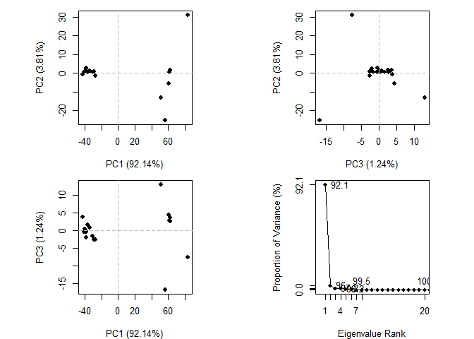

``` r
plot(pc, pc.axes = c(1:2)) 
```

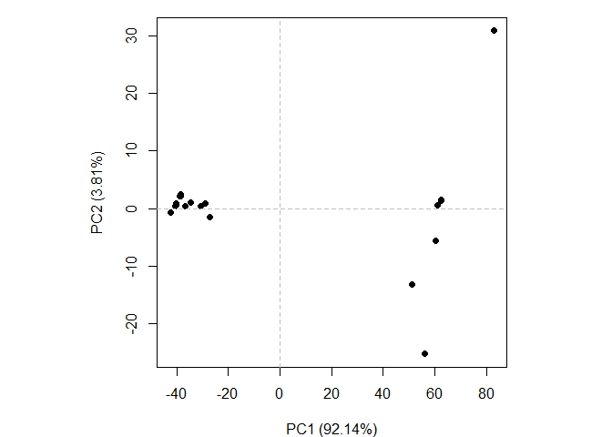

To examine in more detail what PC1 (or any PC) is capturing here we can
plot the loadings or make a movie (trajectory) of moving along PC1.

``` r
#"make trajectory" 

mktrj(pc, pc=1, file="pc1.pdb") 
```

## Analysis of Alpha Fold Results

``` r
results_dir <- "HIVdimertest_23119" 

# File names for all PDB models
pdb_files <- list.files(path=results_dir,
                        pattern="*.pdb",
                        full.names = TRUE)

# Print our PDB file names
basename(pdb_files)
```

    [1] "HIVdimertest_23119_unrelaxed_rank_001_alphafold2_multimer_v3_model_1_seed_000.pdb"
    [2] "HIVdimertest_23119_unrelaxed_rank_002_alphafold2_multimer_v3_model_5_seed_000.pdb"
    [3] "HIVdimertest_23119_unrelaxed_rank_003_alphafold2_multimer_v3_model_4_seed_000.pdb"
    [4] "HIVdimertest_23119_unrelaxed_rank_004_alphafold2_multimer_v3_model_2_seed_000.pdb"
    [5] "HIVdimertest_23119_unrelaxed_rank_005_alphafold2_multimer_v3_model_3_seed_000.pdb"

``` r
HIV_pdbs <- pdbaln(pdb_files, fit=TRUE, exefile="msa")
```

    Reading PDB files:
    HIVdimertest_23119/HIVdimertest_23119_unrelaxed_rank_001_alphafold2_multimer_v3_model_1_seed_000.pdb
    HIVdimertest_23119/HIVdimertest_23119_unrelaxed_rank_002_alphafold2_multimer_v3_model_5_seed_000.pdb
    HIVdimertest_23119/HIVdimertest_23119_unrelaxed_rank_003_alphafold2_multimer_v3_model_4_seed_000.pdb
    HIVdimertest_23119/HIVdimertest_23119_unrelaxed_rank_004_alphafold2_multimer_v3_model_2_seed_000.pdb
    HIVdimertest_23119/HIVdimertest_23119_unrelaxed_rank_005_alphafold2_multimer_v3_model_3_seed_000.pdb
    .....

    Extracting sequences

    pdb/seq: 1   name: HIVdimertest_23119/HIVdimertest_23119_unrelaxed_rank_001_alphafold2_multimer_v3_model_1_seed_000.pdb 
    pdb/seq: 2   name: HIVdimertest_23119/HIVdimertest_23119_unrelaxed_rank_002_alphafold2_multimer_v3_model_5_seed_000.pdb 
    pdb/seq: 3   name: HIVdimertest_23119/HIVdimertest_23119_unrelaxed_rank_003_alphafold2_multimer_v3_model_4_seed_000.pdb 
    pdb/seq: 4   name: HIVdimertest_23119/HIVdimertest_23119_unrelaxed_rank_004_alphafold2_multimer_v3_model_2_seed_000.pdb 
    pdb/seq: 5   name: HIVdimertest_23119/HIVdimertest_23119_unrelaxed_rank_005_alphafold2_multimer_v3_model_3_seed_000.pdb 

``` r
HIV_pdbs
```

                                   1        .         .         .         .         50 
    [Truncated_Name:1]HIVdimerte   PQITLWQRPLVTIKIGGQLKEALLDTGADDTVLEEMSLPGRWKPKMIGGI
    [Truncated_Name:2]HIVdimerte   PQITLWQRPLVTIKIGGQLKEALLDTGADDTVLEEMSLPGRWKPKMIGGI
    [Truncated_Name:3]HIVdimerte   PQITLWQRPLVTIKIGGQLKEALLDTGADDTVLEEMSLPGRWKPKMIGGI
    [Truncated_Name:4]HIVdimerte   PQITLWQRPLVTIKIGGQLKEALLDTGADDTVLEEMSLPGRWKPKMIGGI
    [Truncated_Name:5]HIVdimerte   PQITLWQRPLVTIKIGGQLKEALLDTGADDTVLEEMSLPGRWKPKMIGGI
                                   ************************************************** 
                                   1        .         .         .         .         50 

                                  51        .         .         .         .         100 
    [Truncated_Name:1]HIVdimerte   GGFIKVRQYDQILIEICGHKAIGTVLVGPTPVNIIGRNLLTQIGCTLNFP
    [Truncated_Name:2]HIVdimerte   GGFIKVRQYDQILIEICGHKAIGTVLVGPTPVNIIGRNLLTQIGCTLNFP
    [Truncated_Name:3]HIVdimerte   GGFIKVRQYDQILIEICGHKAIGTVLVGPTPVNIIGRNLLTQIGCTLNFP
    [Truncated_Name:4]HIVdimerte   GGFIKVRQYDQILIEICGHKAIGTVLVGPTPVNIIGRNLLTQIGCTLNFP
    [Truncated_Name:5]HIVdimerte   GGFIKVRQYDQILIEICGHKAIGTVLVGPTPVNIIGRNLLTQIGCTLNFP
                                   ************************************************** 
                                  51        .         .         .         .         100 

                                 101        .         .         .         .         150 
    [Truncated_Name:1]HIVdimerte   QITLWQRPLVTIKIGGQLKEALLDTGADDTVLEEMSLPGRWKPKMIGGIG
    [Truncated_Name:2]HIVdimerte   QITLWQRPLVTIKIGGQLKEALLDTGADDTVLEEMSLPGRWKPKMIGGIG
    [Truncated_Name:3]HIVdimerte   QITLWQRPLVTIKIGGQLKEALLDTGADDTVLEEMSLPGRWKPKMIGGIG
    [Truncated_Name:4]HIVdimerte   QITLWQRPLVTIKIGGQLKEALLDTGADDTVLEEMSLPGRWKPKMIGGIG
    [Truncated_Name:5]HIVdimerte   QITLWQRPLVTIKIGGQLKEALLDTGADDTVLEEMSLPGRWKPKMIGGIG
                                   ************************************************** 
                                 101        .         .         .         .         150 

                                 151        .         .         .         .       198 
    [Truncated_Name:1]HIVdimerte   GFIKVRQYDQILIEICGHKAIGTVLVGPTPVNIIGRNLLTQIGCTLNF
    [Truncated_Name:2]HIVdimerte   GFIKVRQYDQILIEICGHKAIGTVLVGPTPVNIIGRNLLTQIGCTLNF
    [Truncated_Name:3]HIVdimerte   GFIKVRQYDQILIEICGHKAIGTVLVGPTPVNIIGRNLLTQIGCTLNF
    [Truncated_Name:4]HIVdimerte   GFIKVRQYDQILIEICGHKAIGTVLVGPTPVNIIGRNLLTQIGCTLNF
    [Truncated_Name:5]HIVdimerte   GFIKVRQYDQILIEICGHKAIGTVLVGPTPVNIIGRNLLTQIGCTLNF
                                   ************************************************ 
                                 151        .         .         .         .       198 

    Call:
      pdbaln(files = pdb_files, fit = TRUE, exefile = "msa")

    Class:
      pdbs, fasta

    Alignment dimensions:
      5 sequence rows; 198 position columns (198 non-gap, 0 gap) 

    + attr: xyz, resno, b, chain, id, ali, resid, sse, call

``` r
rd <- rmsd(HIV_pdbs, fit=T)
```

    Warning in rmsd(HIV_pdbs, fit = T): No indices provided, using the 198 non NA positions

``` r
range(rd)
```

    [1]  0.000 14.376

``` r
library(pheatmap)

colnames(rd) <- paste0("m",1:5)
rownames(rd) <- paste0("m",1:5)
pheatmap(rd)
```

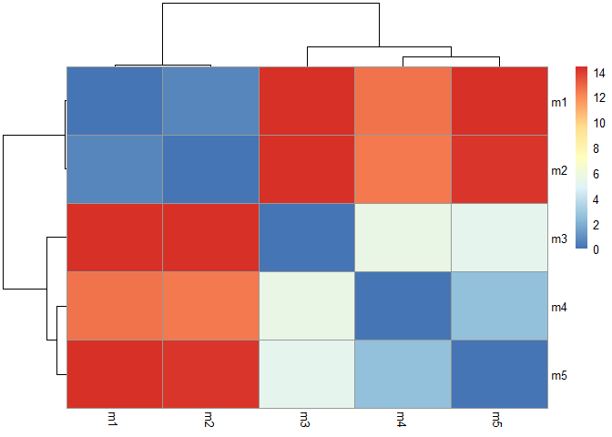

``` r
ref_pdb <- read.pdb("1hsg")
```

      Note: Accessing on-line PDB file

``` r
plotb3(HIV_pdbs$b[1,], typ="l", lwd=2, sse=ref_pdb)
points(HIV_pdbs$b[2,], typ="l", col="red")
points(HIV_pdbs$b[3,], typ="l", col="blue")
points(HIV_pdbs$b[4,], typ="l", col="darkgreen")
points(HIV_pdbs$b[5,], typ="l", col="orange")
abline(v=100, col="gray")
```

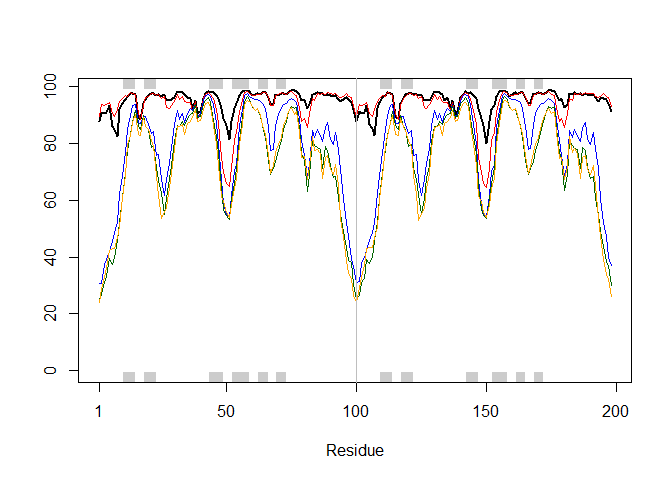

``` r
core <- core.find(HIV_pdbs)
```

     core size 197 of 198  vol = 4916.702 
     core size 196 of 198  vol = 4311.481 
     core size 195 of 198  vol = 4101.445 
     core size 194 of 198  vol = 3907.124 
     core size 193 of 198  vol = 3711.925 
     core size 192 of 198  vol = 3546.511 
     core size 191 of 198  vol = 3440.437 
     core size 190 of 198  vol = 3317.571 
     core size 189 of 198  vol = 3220.079 
     core size 188 of 198  vol = 3142.057 
     core size 187 of 198  vol = 3066.79 
     core size 186 of 198  vol = 3015.892 
     core size 185 of 198  vol = 2959.969 
     core size 184 of 198  vol = 2913.74 
     core size 183 of 198  vol = 2880.923 
     core size 182 of 198  vol = 2848.081 
     core size 181 of 198  vol = 2857.001 
     core size 180 of 198  vol = 2871.24 
     core size 179 of 198  vol = 2905.696 
     core size 178 of 198  vol = 2953.776 
     core size 177 of 198  vol = 3020.847 
     core size 176 of 198  vol = 3087.22 
     core size 175 of 198  vol = 3109.99 
     core size 174 of 198  vol = 3129.601 
     core size 173 of 198  vol = 3135.085 
     core size 172 of 198  vol = 3092.283 
     core size 171 of 198  vol = 3036.012 
     core size 170 of 198  vol = 2947.995 
     core size 169 of 198  vol = 2886.897 
     core size 168 of 198  vol = 2829.355 
     core size 167 of 198  vol = 2746.377 
     core size 166 of 198  vol = 2671.189 
     core size 165 of 198  vol = 2600.848 
     core size 164 of 198  vol = 2534.651 
     core size 163 of 198  vol = 2464.3 
     core size 162 of 198  vol = 2390.171 
     core size 161 of 198  vol = 2322.47 
     core size 160 of 198  vol = 2236.698 
     core size 159 of 198  vol = 2160.475 
     core size 158 of 198  vol = 2077.281 
     core size 157 of 198  vol = 2003.596 
     core size 156 of 198  vol = 1939.94 
     core size 155 of 198  vol = 1859.188 
     core size 154 of 198  vol = 1781.083 
     core size 153 of 198  vol = 1699.1 
     core size 152 of 198  vol = 1622.558 
     core size 151 of 198  vol = 1546.319 
     core size 150 of 198  vol = 1473.01 
     core size 149 of 198  vol = 1414.087 
     core size 148 of 198  vol = 1352.547 
     core size 147 of 198  vol = 1295.278 
     core size 146 of 198  vol = 1246.999 
     core size 145 of 198  vol = 1203.962 
     core size 144 of 198  vol = 1163.009 
     core size 143 of 198  vol = 1110.955 
     core size 142 of 198  vol = 1064.672 
     core size 141 of 198  vol = 1028.458 
     core size 140 of 198  vol = 986.121 
     core size 139 of 198  vol = 944.003 
     core size 138 of 198  vol = 895.914 
     core size 137 of 198  vol = 853.508 
     core size 136 of 198  vol = 827.977 
     core size 135 of 198  vol = 796.874 
     core size 134 of 198  vol = 772.763 
     core size 133 of 198  vol = 743.108 
     core size 132 of 198  vol = 707.65 
     core size 131 of 198  vol = 669.172 
     core size 130 of 198  vol = 634.655 
     core size 129 of 198  vol = 594.035 
     core size 128 of 198  vol = 559.154 
     core size 127 of 198  vol = 525.971 
     core size 126 of 198  vol = 493.19 
     core size 125 of 198  vol = 466.473 
     core size 124 of 198  vol = 438.433 
     core size 123 of 198  vol = 410.725 
     core size 122 of 198  vol = 401.38 
     core size 121 of 198  vol = 391.76 
     core size 120 of 198  vol = 362.084 
     core size 119 of 198  vol = 338.183 
     core size 118 of 198  vol = 312.338 
     core size 117 of 198  vol = 282.176 
     core size 116 of 198  vol = 262.215 
     core size 115 of 198  vol = 241.577 
     core size 114 of 198  vol = 225.151 
     core size 113 of 198  vol = 204.137 
     core size 112 of 198  vol = 185.038 
     core size 111 of 198  vol = 162.728 
     core size 110 of 198  vol = 146.181 
     core size 109 of 198  vol = 133.352 
     core size 108 of 198  vol = 123.207 
     core size 107 of 198  vol = 109.228 
     core size 106 of 198  vol = 98.824 
     core size 105 of 198  vol = 89.735 
     core size 104 of 198  vol = 81.206 
     core size 103 of 198  vol = 74.188 
     core size 102 of 198  vol = 67.042 
     core size 101 of 198  vol = 62.043 
     core size 100 of 198  vol = 58.432 
     core size 99 of 198  vol = 55.149 
     core size 98 of 198  vol = 51.114 
     core size 97 of 198  vol = 45.798 
     core size 96 of 198  vol = 41.161 
     core size 95 of 198  vol = 35.619 
     core size 94 of 198  vol = 29.784 
     core size 93 of 198  vol = 23.233 
     core size 92 of 198  vol = 16.669 
     core size 91 of 198  vol = 9.459 
     core size 90 of 198  vol = 4.595 
     core size 89 of 198  vol = 3.161 
     core size 88 of 198  vol = 2.678 
     core size 87 of 198  vol = 2.293 
     core size 86 of 198  vol = 1.935 
     core size 85 of 198  vol = 1.619 
     core size 84 of 198  vol = 1.367 
     core size 83 of 198  vol = 1.09 
     core size 82 of 198  vol = 0.906 
     core size 81 of 198  vol = 0.764 
     core size 80 of 198  vol = 0.649 
     core size 79 of 198  vol = 0.596 
     core size 78 of 198  vol = 0.53 
     core size 77 of 198  vol = 0.486 
     FINISHED: Min vol ( 0.5 ) reached

``` r
core.inds <- print(core, vol=0.5)
```

    # 78 positions (cumulative volume <= 0.5 Angstrom^3) 
      start end length
    1    10  25     16
    2    28  48     21
    3    53  93     41

``` r
xyz <- pdbfit(HIV_pdbs, core.inds, outpath="corefit_structures")
```

``` r
rf <- rmsf(xyz)

plotb3(rf, sse=ref_pdb)
abline(v=100, col="red", ylab="RMSF")
```

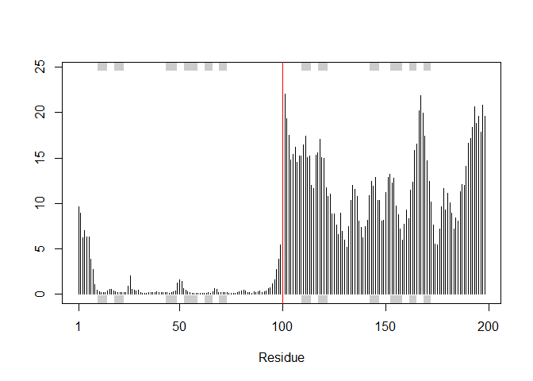

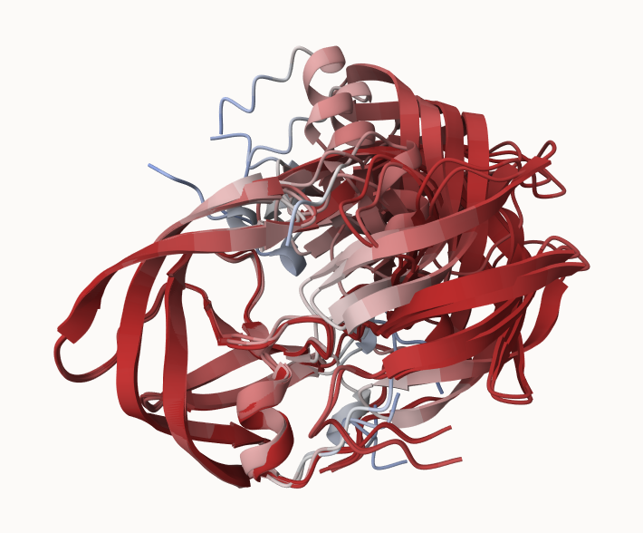

## Predicting Alignment Error

``` r
library(jsonlite)
```

``` r
pae_files <- list.files(path=results_dir,
                        pattern=".*model.*\\.json",
                        full.names = TRUE)
```

``` r
pae1 <- read_json(pae_files[1],simplifyVector = TRUE)
pae5 <- read_json(pae_files[5],simplifyVector = TRUE)

attributes(pae1)
```

    $names
    [1] "plddt"   "max_pae" "pae"     "ptm"     "iptm"   

``` r
head(pae1$plddt) 
```

    [1] 87.69 90.81 90.38 90.88 93.44 86.06

``` r
pae1$max_pae
```

    [1] 15.47656

``` r
pae5$max_pae
```

    [1] 29.32812

``` r
plot.dmat(pae1$pae, 
          xlab="Residue Position (i)",
          ylab="Residue Position (j)")
```

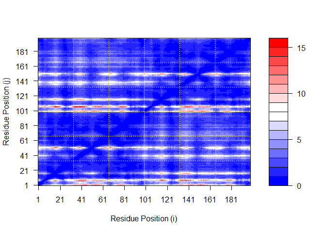

``` r
plot.dmat(pae5$pae, 
          xlab="Residue Position (i)",
          ylab="Residue Position (j)",
          grid.col = "black",
          zlim=c(0,30))
```

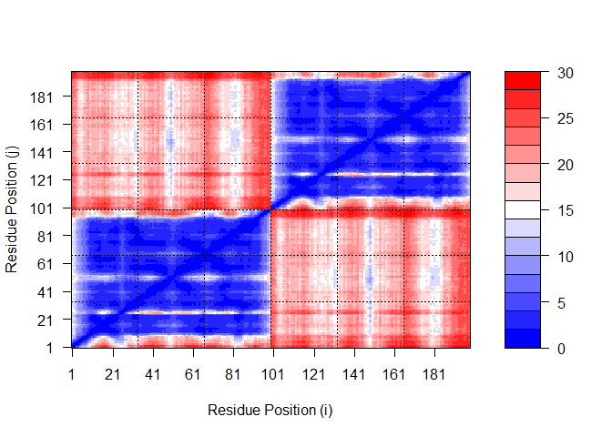

``` r
plot.dmat(pae1$pae, 
          xlab="Residue Position (i)",
          ylab="Residue Position (j)",
          grid.col = "black",
          zlim=c(0,30))
```

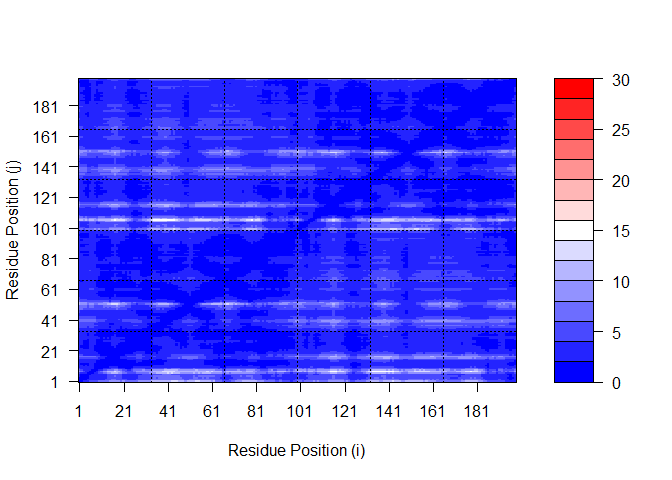

The pae1 seems to be better than the pae5.

``` r
aln_file <- list.files(path=results_dir,
                       pattern=".a3m$",
                        full.names = TRUE)
aln_file
```

    [1] "HIVdimertest_23119/HIVdimertest_23119.a3m"

``` r
aln <- read.fasta(aln_file[1], to.upper = TRUE)
```

    [1] " ** Duplicated sequence id's: 101 **"
    [2] " ** Duplicated sequence id's: 101 **"

``` r
attributes(aln)
```

    $names
    [1] "id"   "ali"  "call"

    $class
    [1] "fasta"

``` r
dim(aln$ali)
```

    [1] 5378  132

Scores residue conservation:

``` r
sim <- conserv(aln)
```

``` r
plotb3(sim[1:99], sse=trim.pdb(ref_pdb, chain="A"),
       ylab="Conservation Score") 
```

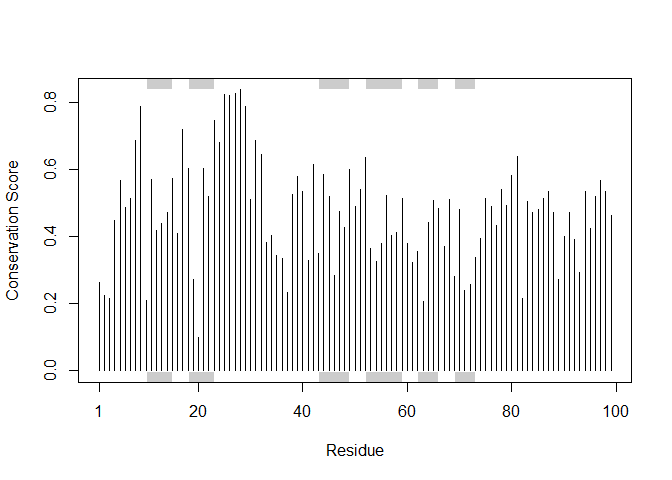

Generate a consensus to highlight conserved residues.

``` r
con <- consensus(aln, cutoff = 0.9)
con$seq
```

      [1] "-" "-" "-" "-" "-" "-" "-" "-" "-" "-" "-" "-" "-" "-" "-" "-" "-" "-"
     [19] "-" "-" "-" "-" "-" "-" "D" "T" "G" "A" "-" "-" "-" "-" "-" "-" "-" "-"
     [37] "-" "-" "-" "-" "-" "-" "-" "-" "-" "-" "-" "-" "-" "-" "-" "-" "-" "-"
     [55] "-" "-" "-" "-" "-" "-" "-" "-" "-" "-" "-" "-" "-" "-" "-" "-" "-" "-"
     [73] "-" "-" "-" "-" "-" "-" "-" "-" "-" "-" "-" "-" "-" "-" "-" "-" "-" "-"
     [91] "-" "-" "-" "-" "-" "-" "-" "-" "-" "-" "-" "-" "-" "-" "-" "-" "-" "-"
    [109] "-" "-" "-" "-" "-" "-" "-" "-" "-" "-" "-" "-" "-" "-" "-" "-" "-" "-"
    [127] "-" "-" "-" "-" "-" "-"

Creates a file for final visualization:

``` r
m1.pdb <- read.pdb(pdb_files[1])
occ <- vec2resno(c(sim[1:99], sim[1:99]), m1.pdb$atom$resno)
write.pdb(m1.pdb, o=occ, file="m1_conserv.pdb")
```

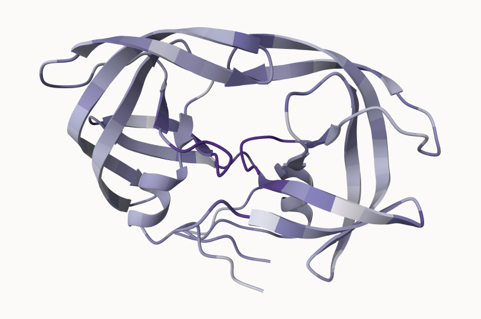
