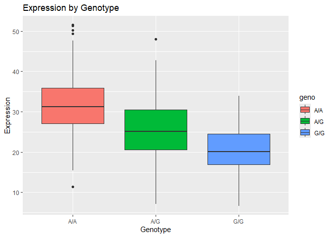

# Class 12 Homework: Plotting Gene Expression
Olivia Baldwin

## Read the table into R

``` r
gene_exp_table <- read.table("rs8067378.txt") 
head(gene_exp_table) 
```

       sample geno      exp
    1 HG00367  A/G 28.96038
    2 NA20768  A/G 20.24449
    3 HG00361  A/A 31.32628
    4 HG00135  A/A 34.11169
    5 NA18870  G/G 18.25141
    6 NA11993  A/A 32.89721

``` r
summary(gene_exp_table) 
```

        sample              geno                exp        
     Length:462         Length:462         Min.   : 6.675  
     Class :character   Class :character   1st Qu.:20.004  
     Mode  :character   Mode  :character   Median :25.116  
                                           Mean   :25.640  
                                           3rd Qu.:30.779  
                                           Max.   :51.518  

``` r
table(gene_exp_table$geno)
```


    A/A A/G G/G 
    108 233 121 

## Create a boxplot.

``` r
library(ggplot2)
```

``` r
ggplot(gene_exp_table) +
  aes(geno, exp, fill=geno) +
  geom_boxplot() +
  labs(x="Genotype", y="Expression", title= "Expression by Genotype")  
```



> Q14: A/A seems to have a higher expression than G/G based on the
> boxplot. The SNP does seem to affect expression as there is large
> difference between the two homozygous alleles.
