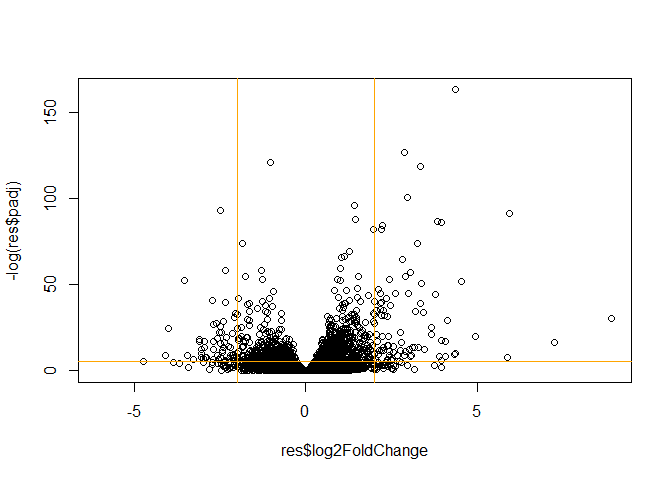
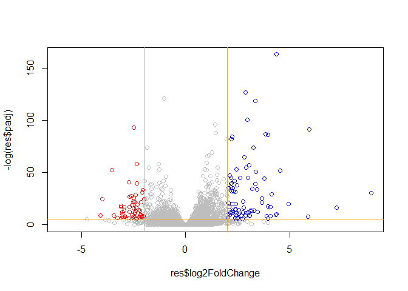

# Class 13: RNA Seq Analysis
Olivia Baldwin

Today we will work with bulk RNASeq data from Himes et al. where airway
smooth muscle (asm) cells were treated with dexamethasone (dex), a
glucocorticoid steriod.

``` r
counts <- read.csv("airway_scaledcounts.csv", row.names = 1)
meta <- read.csv("airway_metadata.csv") 

head(counts)
```

                    SRR1039508 SRR1039509 SRR1039512 SRR1039513 SRR1039516
    ENSG00000000003        723        486        904        445       1170
    ENSG00000000005          0          0          0          0          0
    ENSG00000000419        467        523        616        371        582
    ENSG00000000457        347        258        364        237        318
    ENSG00000000460         96         81         73         66        118
    ENSG00000000938          0          0          1          0          2
                    SRR1039517 SRR1039520 SRR1039521
    ENSG00000000003       1097        806        604
    ENSG00000000005          0          0          0
    ENSG00000000419        781        417        509
    ENSG00000000457        447        330        324
    ENSG00000000460         94        102         74
    ENSG00000000938          0          0          0

``` r
head(meta) 
```

              id     dex celltype     geo_id
    1 SRR1039508 control   N61311 GSM1275862
    2 SRR1039509 treated   N61311 GSM1275863
    3 SRR1039512 control  N052611 GSM1275866
    4 SRR1039513 treated  N052611 GSM1275867
    5 SRR1039516 control  N080611 GSM1275870
    6 SRR1039517 treated  N080611 GSM1275871

``` r
dim(counts)
```

    [1] 38694     8

``` r
table(meta$dex)
```


    control treated 
          4       4 

> Q1: There are 38,694 genes in the `counts` data.

> Q2: There are 4 control samples and 4 treated samples.

Want to compare control vs treated to see the drug’s affect.

1.  Let’s split the counts into `control.counts` and `treated.counts`.

``` r
meta$id == colnames(counts)
```

    [1] TRUE TRUE TRUE TRUE TRUE TRUE TRUE TRUE

Syntax for \[\] is \[rows, columns\]

``` r
control <- meta[meta$dex=="control",] 
control.counts <- counts[,control$id] 
```

``` r
treated <- meta[meta$dex == "treated",] 
treated.counts <- counts[,treated$id]
```

2.  Lets calculate the mean counts per gene for “control” and
    “treated” - then we can compare.

I can use the `apply` function to apply `mean` over the rows or columns
of a data frame.

``` r
control.mean <- apply(control.counts, 1, mean) 
head(control.mean) 
```

    ENSG00000000003 ENSG00000000005 ENSG00000000419 ENSG00000000457 ENSG00000000460 
             900.75            0.00          520.50          339.75           97.25 
    ENSG00000000938 
               0.75 

``` r
treated.mean <- apply(treated.counts, 1, mean) 
head(treated.mean)
```

    ENSG00000000003 ENSG00000000005 ENSG00000000419 ENSG00000000457 ENSG00000000460 
             658.00            0.00          546.00          316.50           78.75 
    ENSG00000000938 
               0.00 

Put these mean counts together into one df for ease.

``` r
meancounts <- data.frame(control.mean, treated.mean)
plot(meancounts) 
```


Let’s log transform it so we can see more of our data points.

``` r
plot(meancounts, log="xy") 
```

    Warning in xy.coords(x, y, xlabel, ylabel, log): 15032 x values <= 0 omitted
    from logarithmic plot

    Warning in xy.coords(x, y, xlabel, ylabel, log): 15281 y values <= 0 omitted
    from logarithmic plot


We most often use log2 transforms here because it makes the math easier.

This is because the log2 of 1 is zero (no change). A 1 would mean a
“doubling” of the amounts.

``` r
#log2(treated/control)
log2(10/10)
```

    [1] 0

``` r
log2(10/20)
```

    [1] -1

``` r
log2(20/10) 
```

    [1] 1

``` r
log2(40/10) 
```

    [1] 2

Let’s calculate the log2 fold change and add it to our table
`meancounts`.

``` r
meancounts$log2fc <- log2(meancounts$treated.mean/meancounts$control.mean)
head(meancounts) 
```

                    control.mean treated.mean      log2fc
    ENSG00000000003       900.75       658.00 -0.45303916
    ENSG00000000005         0.00         0.00         NaN
    ENSG00000000419       520.50       546.00  0.06900279
    ENSG00000000457       339.75       316.50 -0.10226805
    ENSG00000000460        97.25        78.75 -0.30441833
    ENSG00000000938         0.75         0.00        -Inf

Filter out all of the 0 counts from the `meancounts` data.

``` r
to.rm <- rowSums(meancounts[,1:2] == 0) > 0
mycounts <- meancounts[!to.rm, ]
#the `!` means opposite of 

nrow(mycounts) 
```

    [1] 21817

``` r
#this shows that there are only about 22000 genes left after all 0 counts removed 
```

> Q: How many down regulared genes do we have at the common log2 fold
> change value of below -2? **367**

``` r
down <- mycounts$log2fc < -2
sum(down)
```

    [1] 367

> Q: How many up regulated genes do we have at log2 of higher than +2?
> **250**

``` r
up <- mycounts$log2fc > 2
sum(up)
```

    [1] 250

Do we trust these results? Not yet…

We are missing the stats!!

\##DESeq Analysis

``` r
library(DESeq2)
```

DESeq, like many BioConductor packages, wants our input data in a very
specific format.

``` r
dds <- DESeqDataSetFromMatrix(countData = counts, 
                       colData = meta, 
                       design = ~dex) 
```

    converting counts to integer mode

    Warning in DESeqDataSet(se, design = design, ignoreRank): some variables in
    design formula are characters, converting to factors

The main function in DESeq2 is called `DESeq()`.

``` r
dds <- DESeq(dds)
```

    estimating size factors

    estimating dispersions

    gene-wise dispersion estimates

    mean-dispersion relationship

    final dispersion estimates

    fitting model and testing

``` r
res <- results(dds) 
```

``` r
res
```

    log2 fold change (MLE): dex treated vs control 
    Wald test p-value: dex treated vs control 
    DataFrame with 38694 rows and 6 columns
                     baseMean log2FoldChange     lfcSE      stat    pvalue
                    <numeric>      <numeric> <numeric> <numeric> <numeric>
    ENSG00000000003  747.1942     -0.3507030  0.168246 -2.084470 0.0371175
    ENSG00000000005    0.0000             NA        NA        NA        NA
    ENSG00000000419  520.1342      0.2061078  0.101059  2.039475 0.0414026
    ENSG00000000457  322.6648      0.0245269  0.145145  0.168982 0.8658106
    ENSG00000000460   87.6826     -0.1471420  0.257007 -0.572521 0.5669691
    ...                   ...            ...       ...       ...       ...
    ENSG00000283115  0.000000             NA        NA        NA        NA
    ENSG00000283116  0.000000             NA        NA        NA        NA
    ENSG00000283119  0.000000             NA        NA        NA        NA
    ENSG00000283120  0.974916      -0.668258   1.69456 -0.394354  0.693319
    ENSG00000283123  0.000000             NA        NA        NA        NA
                         padj
                    <numeric>
    ENSG00000000003  0.163035
    ENSG00000000005        NA
    ENSG00000000419  0.176032
    ENSG00000000457  0.961694
    ENSG00000000460  0.815849
    ...                   ...
    ENSG00000283115        NA
    ENSG00000283116        NA
    ENSG00000283119        NA
    ENSG00000283120        NA
    ENSG00000283123        NA

``` r
#gives base mean, log2 change, log fold change standard error, stat, p-value and adjusted p-value
```

A common overview figure plots the log2 fold change vs the p-value
(volcano plot).

``` r
plot(res$log2FoldChange, -log(res$padj))
abline(v=c(-2, 2), col="orange") 
abline(h=-log(0.005), col="orange") 
```



``` r
#the `-log` flips the log axis to put the values of interest towards the top 
```

``` r
mycols <- rep("grey", nrow(res))
mycols[res$log2FoldChange > 2] <- "blue"
mycols[res$log2FoldChange < -2] <- "red"
mycols[res$padj > 0.005] <- "grey"

plot(res$log2FoldChange, -log(res$padj), col=mycols)
abline(v=c(-2, 2), col="orange") 
abline(h=-log(0.005), col="orange") 
```



Save our results from DESeq:

``` r
write.csv(res, file="myresults_class13.csv")
```

## Gene Annotation

``` r
head(res)
```

    log2 fold change (MLE): dex treated vs control 
    Wald test p-value: dex treated vs control 
    DataFrame with 6 rows and 6 columns
                      baseMean log2FoldChange     lfcSE      stat    pvalue
                     <numeric>      <numeric> <numeric> <numeric> <numeric>
    ENSG00000000003 747.194195     -0.3507030  0.168246 -2.084470 0.0371175
    ENSG00000000005   0.000000             NA        NA        NA        NA
    ENSG00000000419 520.134160      0.2061078  0.101059  2.039475 0.0414026
    ENSG00000000457 322.664844      0.0245269  0.145145  0.168982 0.8658106
    ENSG00000000460  87.682625     -0.1471420  0.257007 -0.572521 0.5669691
    ENSG00000000938   0.319167     -1.7322890  3.493601 -0.495846 0.6200029
                         padj
                    <numeric>
    ENSG00000000003  0.163035
    ENSG00000000005        NA
    ENSG00000000419  0.176032
    ENSG00000000457  0.961694
    ENSG00000000460  0.815849
    ENSG00000000938        NA

``` r
library("AnnotationDbi")
library("org.Hs.eg.db") 
```

``` r
columns(org.Hs.eg.db)
```

     [1] "ACCNUM"       "ALIAS"        "ENSEMBL"      "ENSEMBLPROT"  "ENSEMBLTRANS"
     [6] "ENTREZID"     "ENZYME"       "EVIDENCE"     "EVIDENCEALL"  "GENENAME"    
    [11] "GENETYPE"     "GO"           "GOALL"        "IPI"          "MAP"         
    [16] "OMIM"         "ONTOLOGY"     "ONTOLOGYALL"  "PATH"         "PFAM"        
    [21] "PMID"         "PROSITE"      "REFSEQ"       "SYMBOL"       "UCSCKG"      
    [26] "UNIPROT"     

``` r
res$symbol <- mapIds(org.Hs.eg.db, keys=row.names(res), keytype="ENSEMBL", column="SYMBOL", multiVals="first")
```

    'select()' returned 1:many mapping between keys and columns

``` r
#the `multiVals` is for when one thing in one database maps to multiple in another, so you decide what you want to take (first, second, all, etc.)
```

``` r
head(res) 
```

    log2 fold change (MLE): dex treated vs control 
    Wald test p-value: dex treated vs control 
    DataFrame with 6 rows and 7 columns
                      baseMean log2FoldChange     lfcSE      stat    pvalue
                     <numeric>      <numeric> <numeric> <numeric> <numeric>
    ENSG00000000003 747.194195     -0.3507030  0.168246 -2.084470 0.0371175
    ENSG00000000005   0.000000             NA        NA        NA        NA
    ENSG00000000419 520.134160      0.2061078  0.101059  2.039475 0.0414026
    ENSG00000000457 322.664844      0.0245269  0.145145  0.168982 0.8658106
    ENSG00000000460  87.682625     -0.1471420  0.257007 -0.572521 0.5669691
    ENSG00000000938   0.319167     -1.7322890  3.493601 -0.495846 0.6200029
                         padj      symbol
                    <numeric> <character>
    ENSG00000000003  0.163035      TSPAN6
    ENSG00000000005        NA        TNMD
    ENSG00000000419  0.176032        DPM1
    ENSG00000000457  0.961694       SCYL3
    ENSG00000000460  0.815849       FIRRM
    ENSG00000000938        NA         FGR

## Pathway Analysis

``` r
library(pathview) 
```

    ##############################################################################
    Pathview is an open source software package distributed under GNU General
    Public License version 3 (GPLv3). Details of GPLv3 is available at
    http://www.gnu.org/licenses/gpl-3.0.html. Particullary, users are required to
    formally cite the original Pathview paper (not just mention it) in publications
    or products. For details, do citation("pathview") within R.

    The pathview downloads and uses KEGG data. Non-academic uses may require a KEGG
    license agreement (details at http://www.kegg.jp/kegg/legal.html).
    ##############################################################################

``` r
library(gage)
```

``` r
library(gageData)
data("kegg.sets.hs") 
```

KEGG take ENTREZ Ids. So I need to convert to the Entrez ID from the
Ensembl.

``` r
res$entrez <- mapIds(org.Hs.eg.db, keys=row.names(res), keytype="ENSEMBL", column="ENTREZID", multiVals="first")
```

    'select()' returned 1:many mapping between keys and columns

``` r
head(res) 
```

    log2 fold change (MLE): dex treated vs control 
    Wald test p-value: dex treated vs control 
    DataFrame with 6 rows and 8 columns
                      baseMean log2FoldChange     lfcSE      stat    pvalue
                     <numeric>      <numeric> <numeric> <numeric> <numeric>
    ENSG00000000003 747.194195     -0.3507030  0.168246 -2.084470 0.0371175
    ENSG00000000005   0.000000             NA        NA        NA        NA
    ENSG00000000419 520.134160      0.2061078  0.101059  2.039475 0.0414026
    ENSG00000000457 322.664844      0.0245269  0.145145  0.168982 0.8658106
    ENSG00000000460  87.682625     -0.1471420  0.257007 -0.572521 0.5669691
    ENSG00000000938   0.319167     -1.7322890  3.493601 -0.495846 0.6200029
                         padj      symbol      entrez
                    <numeric> <character> <character>
    ENSG00000000003  0.163035      TSPAN6        7105
    ENSG00000000005        NA        TNMD       64102
    ENSG00000000419  0.176032        DPM1        8813
    ENSG00000000457  0.961694       SCYL3       57147
    ENSG00000000460  0.815849       FIRRM       55732
    ENSG00000000938        NA         FGR        2268

The `gage()` function will check to see if the Entrez Ids overlap with
known KEGG pathways.

``` r
#gage wants the vector of importance (if doing it for real I would filter out bad padj values first) 

foldchanges <- res$log2FoldChange
names(foldchanges) <- res$entrez
#this will change the ENS... names to the entrez names

keggres <- gage(foldchanges, gsets=kegg.sets.hs) 
```

``` r
attributes(keggres) 
```

    $names
    [1] "greater" "less"    "stats"  

``` r
head(keggres$less, 3)
```

                                          p.geomean stat.mean        p.val
    hsa05332 Graft-versus-host disease 0.0004250461 -3.473346 0.0004250461
    hsa04940 Type I diabetes mellitus  0.0017820293 -3.002352 0.0017820293
    hsa05310 Asthma                    0.0020045888 -3.009050 0.0020045888
                                            q.val set.size         exp1
    hsa05332 Graft-versus-host disease 0.09053483       40 0.0004250461
    hsa04940 Type I diabetes mellitus  0.14232581       42 0.0017820293
    hsa05310 Asthma                    0.14232581       29 0.0020045888

``` r
pathview(gene.data=foldchanges, pathway.id="hsa05310") 
```

    'select()' returned 1:1 mapping between keys and columns

    Info: Working in directory C:/Users/obald/OneDrive/Documents/UCSD/Rscripts/bggn213_github/class13

    Info: Writing image file hsa05310.pathview.png


