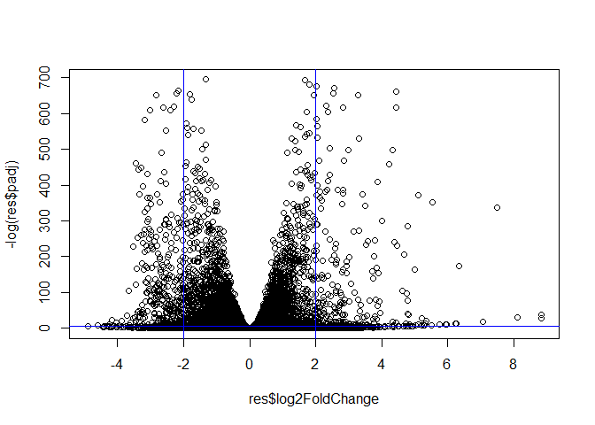

# Class 14: RNA Seq Mini Project
Olivia Baldwin

## Import Data

Counts and Metadata Counts are the colData that DESeq calls for.

``` r
counts <- read.csv("GSE37704_featurecounts.csv", row.names = 1)
metadata <- read.csv("GSE37704_metadata.csv") 
```

## Data CleanUp

Start with an inspection of the data.

``` r
head(counts)
```

                    length SRR493366 SRR493367 SRR493368 SRR493369 SRR493370
    ENSG00000186092    918         0         0         0         0         0
    ENSG00000279928    718         0         0         0         0         0
    ENSG00000279457   1982        23        28        29        29        28
    ENSG00000278566    939         0         0         0         0         0
    ENSG00000273547    939         0         0         0         0         0
    ENSG00000187634   3214       124       123       205       207       212
                    SRR493371
    ENSG00000186092         0
    ENSG00000279928         0
    ENSG00000279457        46
    ENSG00000278566         0
    ENSG00000273547         0
    ENSG00000187634       258

``` r
head(metadata)
```

             id     condition
    1 SRR493366 control_sirna
    2 SRR493367 control_sirna
    3 SRR493368 control_sirna
    4 SRR493369      hoxa1_kd
    5 SRR493370      hoxa1_kd
    6 SRR493371      hoxa1_kd

Check if the IDs in the metadata and the IDs in the counts match.

``` r
metadata$id == colnames(counts) 
```

    Warning in metadata$id == colnames(counts): longer object length is not a
    multiple of shorter object length

    [1] FALSE FALSE FALSE FALSE FALSE FALSE FALSE

``` r
#this will remove the length column in counts 
countData <- counts[,-1] 
```

``` r
# for large data sets `all` will check if they are all true or not 
all(metadata$id == colnames(countData)) 
```

    [1] TRUE

### Filter out the zero count genes from our data.

It is standard practice to remove genes that we have no data for
(i.e. zero counts)

``` r
to.keep <- rowSums(countData) > 0 
clean_counts <- countData[to.keep,]
head(clean_counts) 
```

                    SRR493366 SRR493367 SRR493368 SRR493369 SRR493370 SRR493371
    ENSG00000279457        23        28        29        29        28        46
    ENSG00000187634       124       123       205       207       212       258
    ENSG00000188976      1637      1831      2383      1226      1326      1504
    ENSG00000187961       120       153       180       236       255       357
    ENSG00000187583        24        48        65        44        48        64
    ENSG00000187642         4         9        16        14        16        16

## Set up DESeq

``` r
#|message = FALSE 
library(DESeq2)
```

    Loading required package: S4Vectors

    Loading required package: stats4

    Loading required package: BiocGenerics


    Attaching package: 'BiocGenerics'

    The following objects are masked from 'package:stats':

        IQR, mad, sd, var, xtabs

    The following objects are masked from 'package:base':

        anyDuplicated, aperm, append, as.data.frame, basename, cbind,
        colnames, dirname, do.call, duplicated, eval, evalq, Filter, Find,
        get, grep, grepl, intersect, is.unsorted, lapply, Map, mapply,
        match, mget, order, paste, pmax, pmax.int, pmin, pmin.int,
        Position, rank, rbind, Reduce, rownames, sapply, setdiff, sort,
        table, tapply, union, unique, unsplit, which.max, which.min


    Attaching package: 'S4Vectors'

    The following object is masked from 'package:utils':

        findMatches

    The following objects are masked from 'package:base':

        expand.grid, I, unname

    Loading required package: IRanges


    Attaching package: 'IRanges'

    The following object is masked from 'package:grDevices':

        windows

    Loading required package: GenomicRanges

    Loading required package: GenomeInfoDb

    Loading required package: SummarizedExperiment

    Loading required package: MatrixGenerics

    Loading required package: matrixStats


    Attaching package: 'MatrixGenerics'

    The following objects are masked from 'package:matrixStats':

        colAlls, colAnyNAs, colAnys, colAvgsPerRowSet, colCollapse,
        colCounts, colCummaxs, colCummins, colCumprods, colCumsums,
        colDiffs, colIQRDiffs, colIQRs, colLogSumExps, colMadDiffs,
        colMads, colMaxs, colMeans2, colMedians, colMins, colOrderStats,
        colProds, colQuantiles, colRanges, colRanks, colSdDiffs, colSds,
        colSums2, colTabulates, colVarDiffs, colVars, colWeightedMads,
        colWeightedMeans, colWeightedMedians, colWeightedSds,
        colWeightedVars, rowAlls, rowAnyNAs, rowAnys, rowAvgsPerColSet,
        rowCollapse, rowCounts, rowCummaxs, rowCummins, rowCumprods,
        rowCumsums, rowDiffs, rowIQRDiffs, rowIQRs, rowLogSumExps,
        rowMadDiffs, rowMads, rowMaxs, rowMeans2, rowMedians, rowMins,
        rowOrderStats, rowProds, rowQuantiles, rowRanges, rowRanks,
        rowSdDiffs, rowSds, rowSums2, rowTabulates, rowVarDiffs, rowVars,
        rowWeightedMads, rowWeightedMeans, rowWeightedMedians,
        rowWeightedSds, rowWeightedVars

    Loading required package: Biobase

    Welcome to Bioconductor

        Vignettes contain introductory material; view with
        'browseVignettes()'. To cite Bioconductor, see
        'citation("Biobase")', and for packages 'citation("pkgname")'.


    Attaching package: 'Biobase'

    The following object is masked from 'package:MatrixGenerics':

        rowMedians

    The following objects are masked from 'package:matrixStats':

        anyMissing, rowMedians

``` r
dds <- DESeqDataSetFromMatrix(countData = clean_counts, 
                       colData = metadata,
                       design = ~condition) 
```

    Warning in DESeqDataSet(se, design = design, ignoreRank): some variables in
    design formula are characters, converting to factors

## Run DESeq

``` r
dds <- DESeq(dds) 
```

    estimating size factors

    estimating dispersions

    gene-wise dispersion estimates

    mean-dispersion relationship

    final dispersion estimates

    fitting model and testing

``` r
res <- results(dds) 
```

## Inspect Results

``` r
head(res) 
```

    log2 fold change (MLE): condition hoxa1 kd vs control sirna 
    Wald test p-value: condition hoxa1 kd vs control sirna 
    DataFrame with 6 rows and 6 columns
                     baseMean log2FoldChange     lfcSE       stat      pvalue
                    <numeric>      <numeric> <numeric>  <numeric>   <numeric>
    ENSG00000279457   29.9136      0.1792571 0.3248216   0.551863 5.81042e-01
    ENSG00000187634  183.2296      0.4264571 0.1402658   3.040350 2.36304e-03
    ENSG00000188976 1651.1881     -0.6927205 0.0548465 -12.630158 1.43990e-36
    ENSG00000187961  209.6379      0.7297556 0.1318599   5.534326 3.12428e-08
    ENSG00000187583   47.2551      0.0405765 0.2718928   0.149237 8.81366e-01
    ENSG00000187642   11.9798      0.5428105 0.5215598   1.040744 2.97994e-01
                           padj
                      <numeric>
    ENSG00000279457 6.86555e-01
    ENSG00000187634 5.15718e-03
    ENSG00000188976 1.76549e-35
    ENSG00000187961 1.13413e-07
    ENSG00000187583 9.19031e-01
    ENSG00000187642 4.03379e-01

## Make figures

``` r
plot(res$log2FoldChange, -log(res$padj))
abline(v=c(2, -2), col= "blue")
abline(h=-log(0.005), col = "blue") 
```



## Pathway Analysis

### Annotation

First I need to translate my Ensemble IDs in my `res` object to Entrez
and gene symbol formats.

For this I will use the AnnotationDbi package and the `mapIds()`
function.

Lets map to SYMBOL, ENTREZID, and GENENAME.

``` r
library(AnnotationDbi)
library(org.Hs.eg.db) 
```

``` r
columns(org.Hs.eg.db) 
```

     [1] "ACCNUM"       "ALIAS"        "ENSEMBL"      "ENSEMBLPROT"  "ENSEMBLTRANS"
     [6] "ENTREZID"     "ENZYME"       "EVIDENCE"     "EVIDENCEALL"  "GENENAME"    
    [11] "GENETYPE"     "GO"           "GOALL"        "IPI"          "MAP"         
    [16] "OMIM"         "ONTOLOGY"     "ONTOLOGYALL"  "PATH"         "PFAM"        
    [21] "PMID"         "PROSITE"      "REFSEQ"       "SYMBOL"       "UCSCKG"      
    [26] "UNIPROT"     

``` r
res$genename <- mapIds(org.Hs.eg.db, 
                      keys=rownames(res), 
                      keytype= "ENSEMBL", 
                      column = "GENENAME",
                      multiVals = "first") 
```

    'select()' returned 1:many mapping between keys and columns

``` r
res$symbol <- mapIds(org.Hs.eg.db, 
                      keys=rownames(res), 
                      keytype= "ENSEMBL", 
                      column = "SYMBOL",
                      multiVals = "first") 
```

    'select()' returned 1:many mapping between keys and columns

``` r
res$entrez <- mapIds(org.Hs.eg.db, 
                      keys=rownames(res), 
                      keytype= "ENSEMBL", 
                      column = "ENTREZID",
                      multiVals = "first") 
```

    'select()' returned 1:many mapping between keys and columns

``` r
head(res) 
```

    log2 fold change (MLE): condition hoxa1 kd vs control sirna 
    Wald test p-value: condition hoxa1 kd vs control sirna 
    DataFrame with 6 rows and 9 columns
                     baseMean log2FoldChange     lfcSE       stat      pvalue
                    <numeric>      <numeric> <numeric>  <numeric>   <numeric>
    ENSG00000279457   29.9136      0.1792571 0.3248216   0.551863 5.81042e-01
    ENSG00000187634  183.2296      0.4264571 0.1402658   3.040350 2.36304e-03
    ENSG00000188976 1651.1881     -0.6927205 0.0548465 -12.630158 1.43990e-36
    ENSG00000187961  209.6379      0.7297556 0.1318599   5.534326 3.12428e-08
    ENSG00000187583   47.2551      0.0405765 0.2718928   0.149237 8.81366e-01
    ENSG00000187642   11.9798      0.5428105 0.5215598   1.040744 2.97994e-01
                           padj               genename      symbol      entrez
                      <numeric>            <character> <character> <character>
    ENSG00000279457 6.86555e-01                     NA          NA          NA
    ENSG00000187634 5.15718e-03 sterile alpha motif ..      SAMD11      148398
    ENSG00000188976 1.76549e-35 NOC2 like nucleolar ..       NOC2L       26155
    ENSG00000187961 1.13413e-07 kelch like family me..      KLHL17      339451
    ENSG00000187583 9.19031e-01 pleckstrin homology ..     PLEKHN1       84069
    ENSG00000187642 4.03379e-01 PPARGC1 and ESRR ind..       PERM1       84808

### Filter the Data

Before going further lets focus in on a subset of “top” hits.

We can use log2FC of +2/-2 and a padj of 0.05 as a starting point.

``` r
top.hits <- abs(res$log2FoldChange) > 2 & res$padj < 0.05
top.hits[is.na(top.hits)] <- FALSE 
```

``` r
look <- is.na(top.hits) 
res[look, ]
```

    log2 fold change (MLE): condition hoxa1 kd vs control sirna 
    Wald test p-value: condition hoxa1 kd vs control sirna 
    DataFrame with 0 rows and 9 columns

Let’s save our “top genes” to a file.

``` r
top.genes <- res[top.hits,] 
write.csv(top.genes, file="top_hits.csv") 
```

### Pathway

Now we can do the pathway analysis.

``` r
library(pathview)
```

    ##############################################################################
    Pathview is an open source software package distributed under GNU General
    Public License version 3 (GPLv3). Details of GPLv3 is available at
    http://www.gnu.org/licenses/gpl-3.0.html. Particullary, users are required to
    formally cite the original Pathview paper (not just mention it) in publications
    or products. For details, do citation("pathview") within R.

    The pathview downloads and uses KEGG data. Non-academic uses may require a KEGG
    license agreement (details at http://www.kegg.jp/kegg/legal.html).
    ##############################################################################

``` r
library(gage)
```

``` r
library(gageData) 

data(kegg.sets.hs)
data(sigmet.idx.hs) 
```

``` r
#focuses in on signaling and metabolic pathways 
kegg.sets.hs = kegg.sets.hs[sigmet.idx.hs] 
```

The **gage** funciton wants a vector of importance as input with gene
names as labels (KEGG speaks Entrez)

``` r
foldchanges <- res$log2FoldChange
names(foldchanges) <- res$entrez
head(foldchanges)
```

           <NA>      148398       26155      339451       84069       84808 
     0.17925708  0.42645712 -0.69272046  0.72975561  0.04057653  0.54281049 

``` r
keggres <- gage(foldchanges, gsets = kegg.sets.hs) 
attributes(keggres) 
```

    $names
    [1] "greater" "less"    "stats"  

``` r
head(keggres$less)
```

                                             p.geomean stat.mean        p.val
    hsa04110 Cell cycle                   8.995727e-06 -4.378644 8.995727e-06
    hsa03030 DNA replication              9.424076e-05 -3.951803 9.424076e-05
    hsa03013 RNA transport                1.246882e-03 -3.059466 1.246882e-03
    hsa03440 Homologous recombination     3.066756e-03 -2.852899 3.066756e-03
    hsa04114 Oocyte meiosis               3.784520e-03 -2.698128 3.784520e-03
    hsa00010 Glycolysis / Gluconeogenesis 8.961413e-03 -2.405398 8.961413e-03
                                                q.val set.size         exp1
    hsa04110 Cell cycle                   0.001448312      121 8.995727e-06
    hsa03030 DNA replication              0.007586381       36 9.424076e-05
    hsa03013 RNA transport                0.066915974      144 1.246882e-03
    hsa03440 Homologous recombination     0.121861535       28 3.066756e-03
    hsa04114 Oocyte meiosis               0.121861535      102 3.784520e-03
    hsa00010 Glycolysis / Gluconeogenesis 0.212222694       53 8.961413e-03

``` r
#pathway view of the top result in the keggres$less column

pathview(foldchanges, pathway.id = "hsa04110") 
```

    'select()' returned 1:1 mapping between keys and columns

    Info: Working in directory C:/Users/obald/OneDrive/Documents/UCSD/Rscripts/bggn213_github/class14

    Info: Writing image file hsa04110.pathview.png

## GO - Gene Ontology

``` r
data(go.sets.hs)
data(go.subs.hs)

# Focus on Biological Process subset of GO
gobpsets = go.sets.hs[go.subs.hs$BP]

gores = gage(foldchanges, gsets=gobpsets)
```

``` r
head(gores$less)
```

                                                p.geomean stat.mean        p.val
    GO:0048285 organelle fission             1.536227e-15 -8.063910 1.536227e-15
    GO:0000280 nuclear division              4.286961e-15 -7.939217 4.286961e-15
    GO:0007067 mitosis                       4.286961e-15 -7.939217 4.286961e-15
    GO:0000087 M phase of mitotic cell cycle 1.169934e-14 -7.797496 1.169934e-14
    GO:0007059 chromosome segregation        2.028624e-11 -6.878340 2.028624e-11
    GO:0000236 mitotic prometaphase          1.729553e-10 -6.695966 1.729553e-10
                                                    q.val set.size         exp1
    GO:0048285 organelle fission             5.843127e-12      376 1.536227e-15
    GO:0000280 nuclear division              5.843127e-12      352 4.286961e-15
    GO:0007067 mitosis                       5.843127e-12      352 4.286961e-15
    GO:0000087 M phase of mitotic cell cycle 1.195965e-11      362 1.169934e-14
    GO:0007059 chromosome segregation        1.659009e-08      142 2.028624e-11
    GO:0000236 mitotic prometaphase          1.178690e-07       84 1.729553e-10

## Reactome

To run reactome online we need to make a text file with a gene id per
line.

``` r
sig_genes <- res[res$padj <= 0.05 & !is.na(res$padj), "symbol"]
print(paste("Total number of significant genes:", length(sig_genes))) 
```

    [1] "Total number of significant genes: 8147"

``` r
write.table(sig_genes, file="significant_genes.txt", 
            row.names=FALSE, 
            col.names=FALSE, 
            quote=FALSE) 
```


